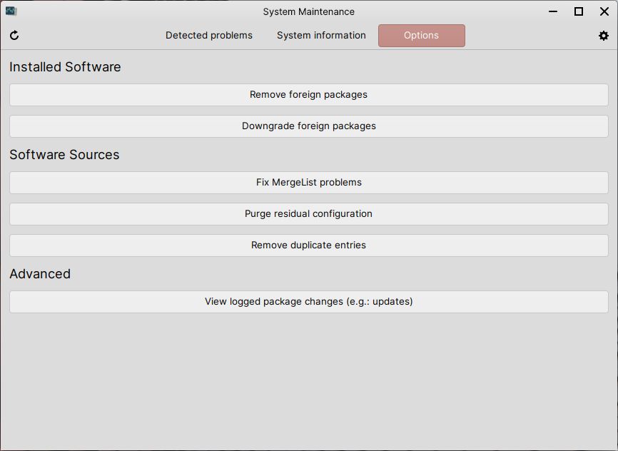

Removing or downgrading foreign packages
==================

If you ever install packages from external places on the internet, or have packages still installed from 3rd-party sources that you have since removed, System Maintenance can find these packages and either remove or downgrade them from your system.

System Maintenance can be found at :menuselection:`Applications Menu --> System --> System Maintenance`. When in System Maintenance, click the :guilabel:`Options` tab at the top of the window.

Once you're done with the task you want to do below, feel free to close System Maintenance.

Removing foreign packages
----------------

Click the :guilabel:`Remove foreign packages` button, wait a while for a new window to open, select the foreign packages you would like to remove from the list shown in that new window and then click :guilabel:`Remove` to remove those selected packages.

Downgrading foreign packages
----------------

Click the :guilabel:`Downgrade foreign packages` button, wait a while for a new window to open, select the foreign packages you would like to downgrade from the list shown in that new window and then click :guilabel:`Downgrade` to downgrade those selected packages.