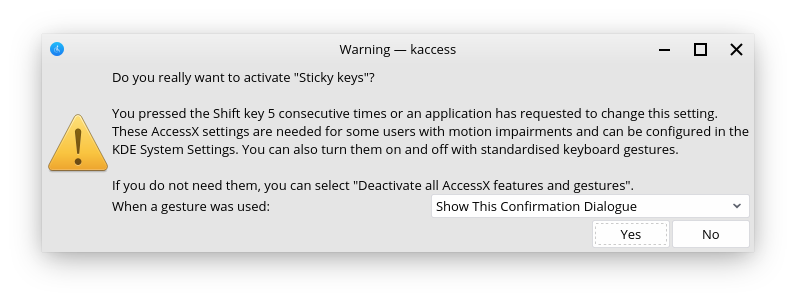

Accessibility Options
==================

Finding the accessibility options
----------------

Accessibility options are an important feature for certain users with disabilities who need special tweaks to be able to better make use of their Operating System. Feren OS has accessibility options available right out of the box in System Settings.

To find them, you will first need to open System Settings. You can do this by going into Applications Menu (the bird icon on the bottom-left) --> :guilabel:`Settings` --> :guilabel:`System Settings`.

In Feren OS Classic you'll find System Settings on the right-side of the applications menu immediately as you open it, unless you have chosen the "Linux Mint Layout" in which case it will be in :guilabel:`Preferences` --> :guilabel:`System Settings`.

Once you've opened up System Settings, go to the item called "Accessibility". It will be there with an icon that has a person with their arms held up slightly in a blue circle.

From here, you can change your accesibility options.

Once you've done the changes you want to make, hit the 'Apply' button at the bottom-right side of the window to apply the changes.

Activating "Keys" Accessibility Features using the keyboard
-------------------------------------

It is also possible to activate Sticky Keys and Slow Keys at any time using the keyboard.

- To activate Sticky Keys press :kbd:`Shift` 5 times in fast succession

- To activate Slow Keys hold :kbd:`Shift` for 8 seconds

- To activate Mouse Keys hold :kbd:`Shift` and press :kbd:`NumLock`

.. warning::
    These keyboard triggers for the aforementioned keys features may not work on Feren OS Classic.
    
Once you have done this, a dialog will, by default, appear to confirm if you want to enable the feature you tried to enable or not. From here you can press Yes, No, or even change whether the dialog displays in the future or not.

The dialog will look similar to this below image in Feren OS:

