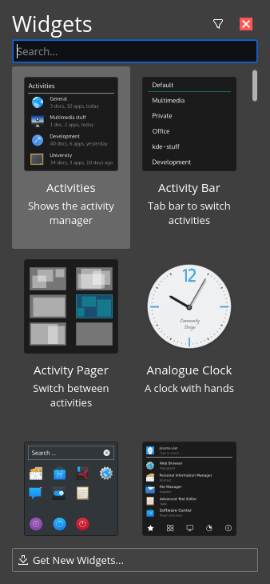

Adding widgets to your desktop
==================

Feren OS
----------------

Adding widgets is very easy in Feren OS. To do so, do the following:

1. Right-click your desktop or any panel

2. Click :guilabel:`Add Widgets...`

3. A sidebar will now open up on the left, like this:

    Add Widgets Sidebar

4. Drag any item on the sidebar's item grid of widgets to either the desktop or a panel to place the widget there.

5. Hit the close button on the top-right of the sidebar when you're done adding widgets

.. hint::
    Adding a widget triggers the "Show Desktop" feature to move your windows out of the way. If Show Desktop is still active hit :kbd:`Super` + :kbd:`D` to deactivate Show Desktop once more.

Feren OS Classic
----------------

Feren OS Classic's Cinnamon Desktop Environment splits the widgets into two types:

* Applets - widgets on the panel
* Desklets - widgets on the desktop

Depending on what widgets you want to add where, open System Settings, open the applicable page in System Settings, select the widget you want to add and hit the :guilabel:`+` icon to place it on your panel/desktop.

If it's a Desklet, you can immediately freely drag the new widget to where you want it to be at.

If it's an Applet, you will need to right-click the panel and turn on :guilabel:`Panel Edit Mode` before you can move the applet on the panel, and then turn "Panel Edit Mode" off right afterwards to restore panel functionality.