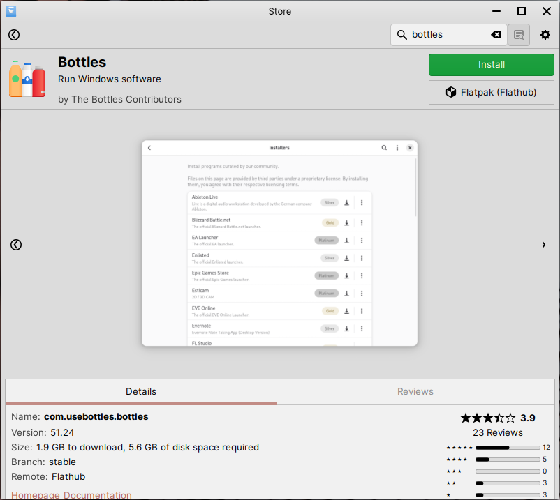

Bottles
==================

Bottles is a general-purpose Microsoft Windows program manager that provides a game launcher installation experience made by the community.

You can get Bottles right from the Store. To find it in Store, do the following:

1. Open Store

2. Go to the :guilabel:`Flatpak` category

3. Select :guilabel:`Bottles`

4. Click :guilabel:`Install` on the Bottles page in Store

.. hint::
    Can't find Bottles in the applications listed? Just use the search bar at the top right to search for it instead.

    Bottles in Store

Getting help with Bottles
-------------------------------------

You can get help with using Bottles from the following websites:

* `Getting started with Bottles <https://docs.usebottles.com>`_
* `Bottles GitHub Discussions <https://github.com/orgs/bottlesdevs/discussions>`_
* `Report a bug in Bottles <https://github.com/bottlesdevs/Bottles/issues>`_