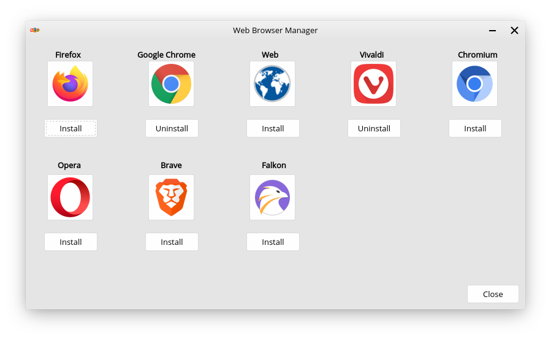

Web Browser Manager
==================

What is Web Browser Manager?
----------------

Web Browser Manager is an application made for Feren OS that lets you easily install and remove popular web browsers, including those that currently cannot be obtained by default from the Store.

You can find it in the :guilabel:`Internet` category in the Applications Menu.

    Web Browser Manager

Using Web Browser Manager
----------------

Using Web Browser Manager is rather simple. Each button in the Browser Manager corresponds to a different action:

* Clicking the web browser's logo gives you a quick and concise description of the browser you clicked the logo of
* Clicking :guilabel:`Install` starts the installation process of the browser beneath that button
* Clicking :guilabel:`Uninstall` starts the removal process of the browser beneath that button
* Clicking :guilabel:`Close` or closing the window quits Web Browser Manager