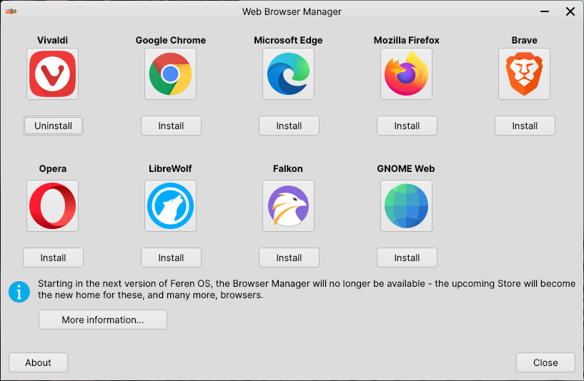

Web Browser Manager
==================

What is Web Browser Manager?
----------------

Web Browser Manager is a built-in utility that lets you easily install and remove popular web browsers, including those that currently cannot be obtained by default from the Store.

You can find it at :menuselection:`Applications Menu --> Internet --> Web Browser Manager`.

    Web Browser Manager

Changing the default web browser
----------------

Feren OS makes it effortless to change your default browser.

1. Open System Settings (:menuselection:`Applications Menu --> Settings --> System Settings`)
2. In System Settings, go to :menuselection:`Applications --> Default Applications`
3. Click the dropdown that appears next to :guilabel:`Web browser`, and select your new default web browser
4. Click on :guilabel:`Apply`

.. hint::
    Unless you unpinned/unfavourited it, the Task Manager pin and Applications Menu favourite of your previous default web browser will change automatically to your default web browser when changed.