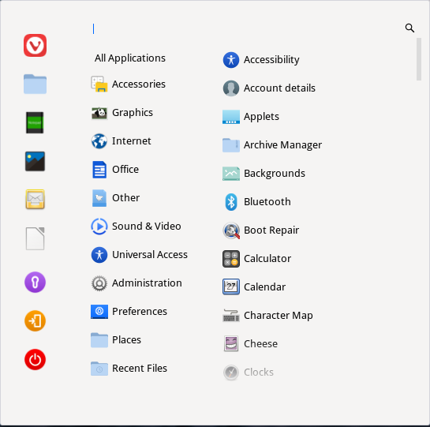

Using the Desktop (Feren OS Classic)
==================

The default Feren OS Classic
----------------

When you first log into Feren OS Classic, and if you skip over the layout section of "Welcome to Feren OS", you will have this desktop:

    The default Feren OS Classic desktop

This desktop can be either left alone to be your default desktop or can be the beginnings of your own desktop customisation, however that is beside the point.

The desktop, by default, is laid out into these core fundamentals:

* Icons are on the desktop for whatever you place in your Desktop folder
* At the top-right of the screen there is a desktop clock that stays on the desktop unless disabled (alternatively it'll be on the bottom-right if the desktop clock is disabled)
* At the bottom-left you will find your Applications Menu (the Feren OS logo), and next to that your pinned and open applications
* Finally, at the bottom-right you will find your System Tray (click the up arrow to reveal hidden tray indicators and click each icon for their respective statuses)

Tablet Mode
----------------

If you choose Tablet Mode as your layout for Feren OS, the desktop will look and work slightly differently than it does by default.

    Tablet Mode in action

The desktop, in this layout, is laid out into these core fundamentals:

* Icons are on the desktop for whatever you place in your Desktop folder
* At the bottom-left you will find your Applications Menu (the Feren OS logo), and next to that search, virtual desktops, your pinned applications and open applications
* Finally, at the bottom-right you will find your System Tray (click the up arrow to reveal hidden tray indicators and click each icon for their respective statuses), clock and calendar, and titlebar buttons

Applications Menu - CinnVIIStarkMenu
----------------

The applications menu is the place to go to whenever you want to launch an application. It's quite simple to use when you get the hang of the menu, however I might as well explain what each part of the menu is and does.

* On the initial menu page, the list on the left is your Favourite Applications
* On the initial menu page, the list on the right is your custom menu items list, and below that is Shut Down, Log Out and Lock
* The search bar at the bottom lets you search for applications
* On the "All Apps" page, the list on the left is your categories - hover each category to show the applications in them
* Finally, on the "All Apps" page, the list on the right is the list of applications on your currently viewed category

Applications Menu - Menu (Linux Mint Layout)
----------------

The applications menu is the place to go to whenever you want to launch an application. The application menu works differently if you choose the :guilabel:`Linux Mint Layout`. Here's how it works:

* On the direct left of the menu is a row of buttons consisting of your favourite applications, Switch User, Log Out and Shut Down
* The list next to that is all the categories for applications installed on your system - hover over each category to view the applications in that category
* The list to the right is the list of applications in the currently viewed category
* Finally, the search bar at the top lets you search for applications