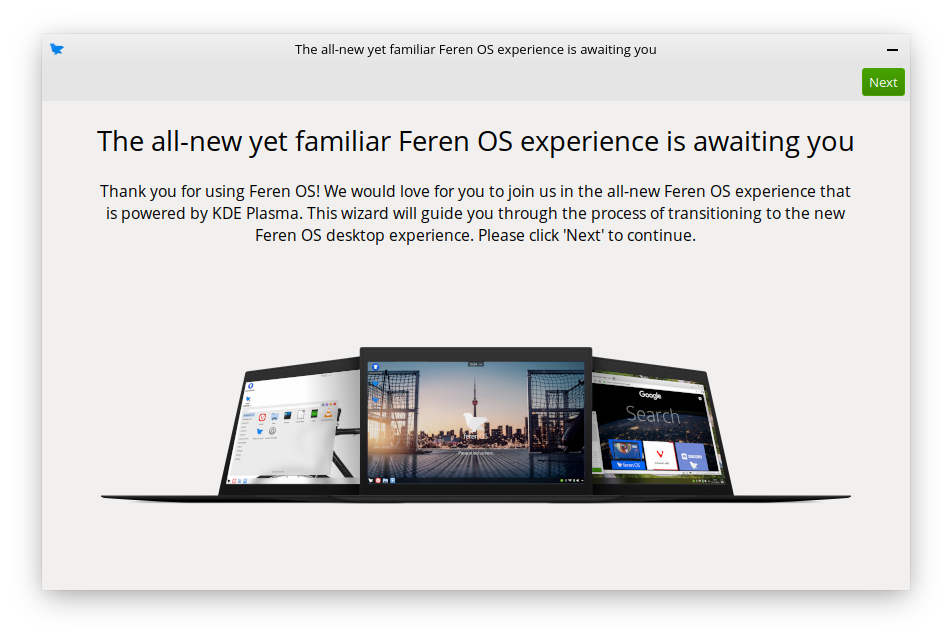
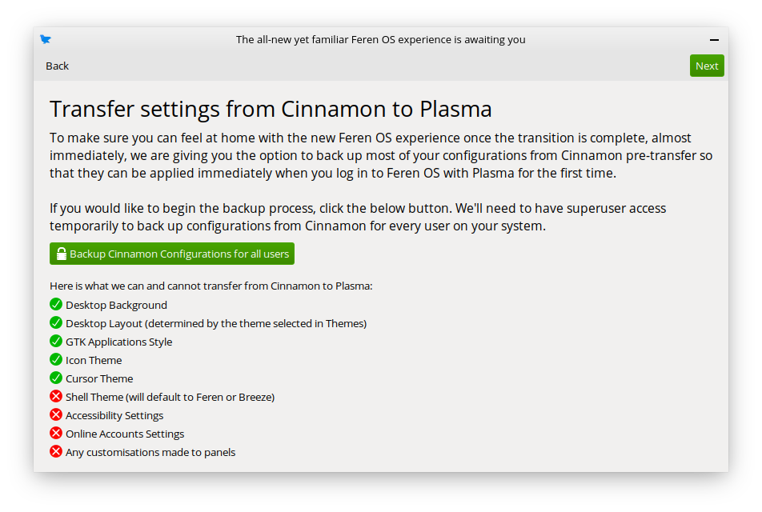
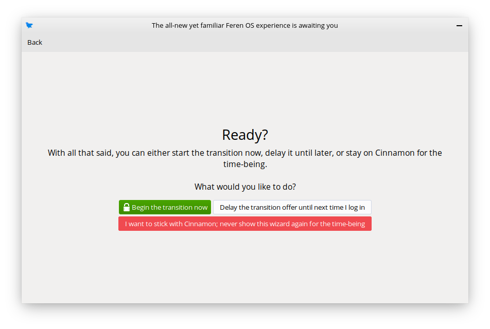

Transitioning from Feren OS Classic to Feren OS
==================

What you need
----------------

Before you can start this guide, you will need the following prepared and ready:

- An existing Feren OS Classic installation

- feren-cinn2plas ("Transition to the new Feren OS") being installed on your system

- An internet connection

.. hint::
    "feren-cinn2plas" should be automatically installed by an update to "feren-app-packages-cinnamon" that you can obtain in Update Manager. If you still do not have it then go into the Store, search for and manually install "Feren-cinn2plas".

Once you have these three things, you can continue on this guide.

Transitioning from Feren OS Classic to Feren OS
----------------

To start off, you should open "Transition to the new Feren OS" up if it is not already running. When it's running, you should see this window appear:

    Transition to the new Feren OS (feren-cinn2plas)'s first page

Once it has appeared, click :guilabel:`Next` and then :guilabel:`Next` again.

You will now be taken to a page offering you the ability to transfer some settings from Feren OS Classic to Feren OS. Click :guilabel:`Backup Cinnamon Configurations for all users` and authenticate. A dialog will then appear to confirm that the backup was successful and is ready for being restored later, so click :guilabel:`OK` on that dialog. After that, press :guilabel:`Next`.

.. hint::
    Backing up the current Cinnamon settings for all users on the system is entirely optional. You can skip over this page if you want to start afresh when transitioned over to Feren OS.

    
Now you will be taken to the final page. This is where you can choose to start the transition now, delay it until the next time you log in or never show the dialog again.

    
.. warning::
    Once you have confirmed the transition there is no way to cancel it unless an error occurs.

For the purpose of this guide, you will want to click on :guilabel:`Begin the transition now`. A final confirmation dialog will appear to make sure you're entirely fine with doing the transition now rather than later. Click :guilabel:`Yes` to confirm starting the transition and you will then get an authentication dialog. Authenticate through that dialog and the transition process will begin.

.. warning::
    Feren OS will restart automatically without asking during the transition process to start Phase 2 of the transition process (no longer necessary packages are removed and preparations are made for the new experience during the next boot). You should save your work before you start the transition.

Once Feren OS has restarted itself it will then indicate on the boot screen that it is finishing the transition process. You can press :kbd:`Ctrl` + :kbd:`Alt` + :kbd:`F2` to see the progress in verbose mode at any time if you'd like to. Once this process is complete Feren OS will take you to the login screen.

Once you're at the login screen the transition has completed successfully. Just log in to start the settings restoration process (if you have backed up data from Cinnamon) and go through some new pages of the OOBE window.

Once that is all done, welcome to the new Feren OS!