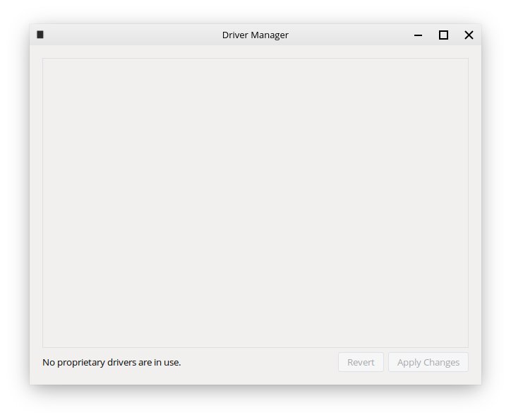

Driver Manager
================

The Driver Manager is a tool that lets you manage certain drivers on Feren OS that currently cannot be legally distributed with Feren OS.

You will need to use Driver Manager if:

- Your machine uses NVIDIA Graphics Drivers

- Your machine uses Broadcom Wireless Drivers

1. Open Driver Manager (:menuselection:`Applications Menu --> System / Administration --> Driver Manager`).

.. hint::
    If you are offline, the Driver Manager will complain that it cannot connect to the Internet.

    .. figure:: images/mintdrivers-2.png
        :width: 500px
        :align: center

    Insert the USB stick or DVD you flashed/burned your Feren OS ISO to earlier, wait for it to be mounted, and click :guilabel:`OK`.

2. Tick the appropriate checkboxes to select the available drivers and click :guilabel:`Apply Changes`.

3. Restart the computer.