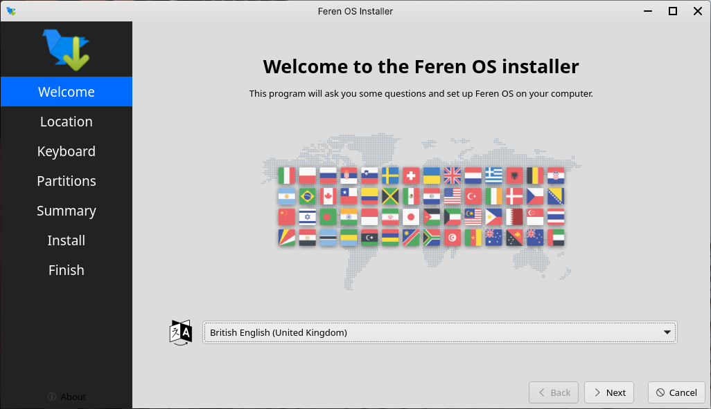
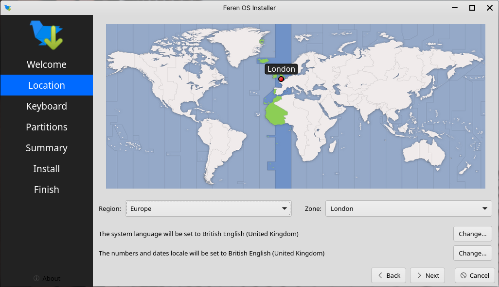
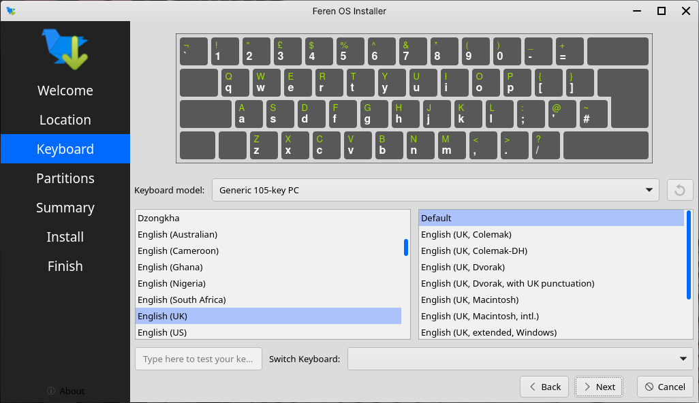
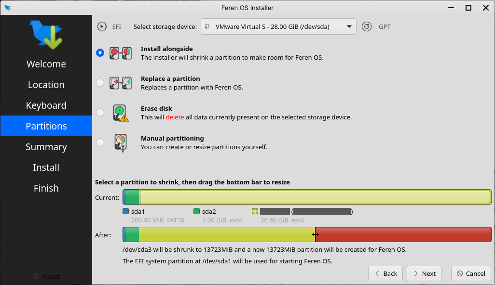
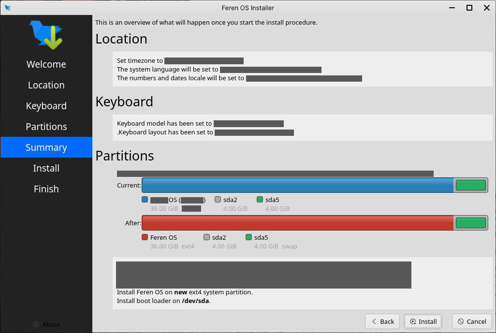

Installing Feren OS
==================

Opening the installer
----------------

To start installing Feren OS you will want to run the installer. The installer is located in the following locations:

* The :guilabel:`Install Feren OS` shortcut placed on the desktop
* :menuselection:`Applications Menu (bottom-left bird icon) --> System --> Install Feren OS`

Step 1: Launch the installer
----------------

Once you have the installer opened up you should see a screen similar to the one shown in the below image:

    Feren OS's installer

Now that you are in the installer, select your language using the dropdown menu at the bottom of the window and then press :guilabel:`Next`.

Step 2: Select your location
----------------

You should now see a location select screen. From here either click where you are on the world map or use the dropdown menus below the map to select your region and zone.

Once you've set your location click :guilabel:`Next` again.

Step 3: Select your keyboard layout
----------------

You should now see a keyboard layout selection screen. From here select your computer's keyboard layout and, using the "Type here" textbox at the bottom-left, try each key on your keyboard to make sure they match.

Once you've set your keyboard layout click :guilabel:`Next` again.

Step 4: Install alongside Linux
----------------

Now you'll have the option to either replace a partition with Feren OS, install Feren OS alongside your current Operating System or partition Feren OS manually.

.. warning::
    Be sure to check the dropdown menu at the top of this screen to make sure it has selected the correct disk to install Feren OS onto. Better safe than sorry.

Select :guilabel:`Install alongside`, click the existing Linux's partition in the "Current" partition bar at the bottom of the window, select the amount of maximum disk space that you want Feren OS to have on your computer from the "After" partition bar found underneath, and then click :guilabel:`Next`.

Step 5: Confirmation
----------------

You'll now be taken to a page that summarises what will be done during installation. This will allow you to look over what you have chosen for your new Feren OS installation before installation begins.

Once you're sure you've got everything correct, click :guilabel:`Install` and then :guilabel:`Install now` on the final confirmation dialog.

.. warning::
    Once you have hit :guilabel:`Install now` there is no going back to change the installation settings. Make sure you've got everything just the way you want it before you confirm beginning the installation.

Wait until complete
----------------

Feren OS will now be installed. Have a cup of coffee or something as Feren OS will take a little while to install onto your machine.

Once Feren OS has finished installing, it will take you to a screen saying "All Done". From here you can choose whether you want to immediately restart into your new Feren OS installation when you click :guilabel:`Done` or not.

.. figure:: images/calamares5.png
    :width: 1024px
    :align: center

Congrats, you have installed Feren OS! When rebooting eject your USB or DVD and press :kbd:`Enter` on your keyboard when Feren OS prompts you to :guilabel:`remove your installation medium, then press ENTER`.

Next Steps
-------------------------------------

* `Setting up Feren OS <https://feren-os-user-guide.readthedocs.io/en/latest/duallinux/initialsetup.html>`_
