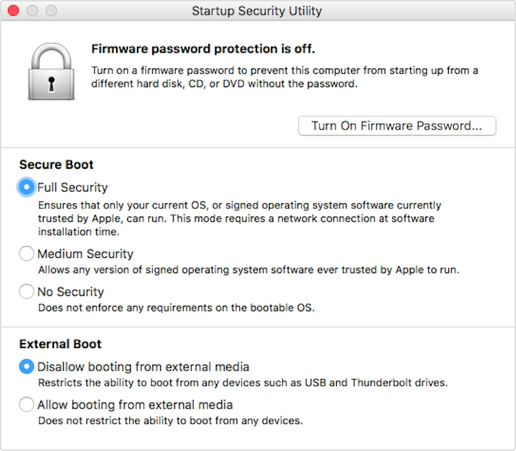

Preparing
==================

Making room for Feren OS
-------------------------------------

To start off, you need to be logged into macOS as an Administrator - if you haven't created any extra users, your first created account is an Administrator.

In the Administrator's Desktop, open Disk Utility by searching for it in Launchpad or Spotlight.

In Disk Utility, click :guilabel:`View` on the toolbar at the top of Disk Utility, then select :guilabel:`Show All Devices` in the menu that appears so that all devices are made visible.

On the left sidebar, under :guilabel:`Internal`, select the hard drive that contains "Macintosh HD" (don't select anything on the sidebar that is inside of the hard drive), then look on the toolbar at the top for :guilabel:`Partition` and click it.

A dialog will now appear, unless you have disabled it in the past - click :guilabel:`Partition` to continue.

In the partitioner that appears, look under the pie chart for a :guilabel:`+` and :guilabel:`-` button pair - Press the :guilabel:`+` button.

A new segment will appear in the pie chart. Drag the edge of the pie segment to resize the partition to have the maximum disk space that you want Feren OS to have on your computer, then under :guilabel:`Format` select :guilabel:`MS-DOS (FAT)` and click :guilabel:`Apply`.

Finally, click :guilabel:`Partition` on the dialog that appears. You have successfully made free space to install Feren OS onto later - leave it as-is for now and quit Disk Utility.

Disable Secure Boot
----------------

.. hint::
    This only affects Apple Macs that were made in 2018 or newer as prior Apple computers do not come with the T2 Security Chip and should therefore be able to boot Feren OS immediately with no fuss. If your computer predates this change, skip to the next steps.

Modern Apple computers have introduced the T2 Security Chip (or similar) out of the box. This security chip however prevents anything that is not Apple's macOS from running for security reasons, including Feren OS.

Because of this, you will need to disable Secure Boot in order to be able to boot into Feren OS.

To disable Secure Boot, you'll first need to enter macOS Recovery. To do this, turn on your Mac and hold :kbd:`Command (⌘)` + :kbd:`R` after you see the Apple logo to boot into macOS Recovery.

Once in there, you'll see the "macOS Utilities" window. Go to the top of the screen and look for a :guilabel:`Utilities` menu. Open it and select the :guilabel:`Startup Security Utility` option.

You will then be prompted to authenticate. From there click :guilabel:`Enter macOS Password`, choose an administrator account (e.g.: the first account you ever made on your computer) and enter the password for that account.

If you've done this correctly, the window shown below should now pop up on screen:

    Source: https://support.apple.com/en-us/HT208330

To disable Secure Boot, choose :guilabel:`No Security` under :guilabel:`Secure Boot` and choose :guilabel:`Allow booting from external media` under :guilabel:`External Boot`.

Now simply close the window and power off macOS.

Next Steps
-------------------------------------

- `Boot Feren OS from USB or DVD <https://feren-os-user-guide.readthedocs.io/en/latest/dualmac/liveboot.html>`_