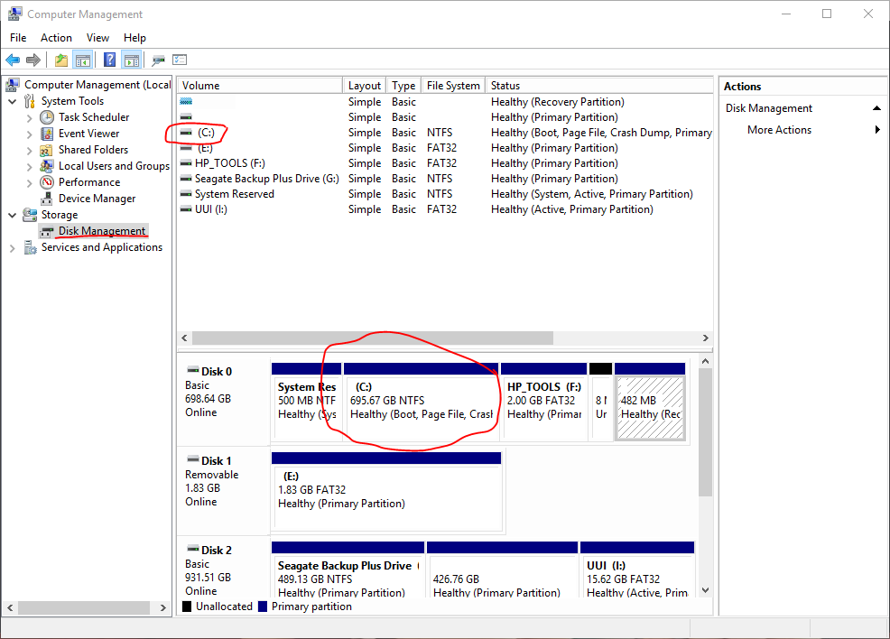

Microsoft Windows 7 or older
==================

Making room for Feren OS
-------------------------------------

.. hint::
    "Free space" is not being used in the terminology you might think of here - instead it refers to a partition-less area of your hard drive disk where you can add a partition, or expand an existing partition, into.

To start off, go into Start and search for "compmgmt.msc". You should then get a result called either "Computer Management" or "compmgmt.msc" - right-click on it and select :guilabel:`Run as Administrator` in the menu that appears.

In Computer Management, look on the left, under :guilabel:`Storage`, and click on the item called :guilabel:`Disk Management`.

Now you're in Disk Management you'll see a bunch of lettered drives listed on the bottom-center - "(C:)" usually represents your Microsoft Windows installation's partition, although not always - go to :menuselection:`File Explorer --> This PC / Computer` and check which drive has the Microsoft Windows logo on it to identify the partition.

.. hint::
     "Partition" refers to an allocated amount of a disk, such as your computer's hard drive, for data to be stored on, in simple terms. Different Operating Systems have their own partitions dedicated to themselves, such as Microsoft Windows having a partition for the main "C:" drive and another partition for its Microsoft Windows Recovery Environment to be stored on.

Right-click the Microsoft Windows partition in the blocks at the bottom of Disk Management, then click :guilabel:`Shrink Volume` on the menu that appears.

Now wait a few moments while Disk Management checks how far down the size of that partition can go. When finished, a dialog will appear - enter the amount of maximum disk space that you want Feren OS to have on your computer in the :guilabel:`Enter the amount to shrink in MB` textbox.

.. hint::
    1GB = 1024MB - use the Calculator application to calculate your desired disk space properly.

.. warning::
    Disk Management will cap the maximum size that you can shrink Microsoft Windows by based on factors such as available disk space. If the maximum is lower than your desired disk space for Feren OS, free up disk space and, if applicable, defragment the main Microsoft Windows partition to increase the maximum shrinkability.

    Feren OS requires at least 20GB in disk space to be fully usable after being installed.

Now you have specified the amount to shrink the Microsoft Windows partition by, click :guilabel:`Shrink`. After a brief wait period, you should now see a new block, with black above it, to the right of the Microsoft Windows partition - if it says "Unallocated" you have successfully made free space to install Feren OS onto later - leave it as-is for now.

Next Steps
----------------

- `Booting the USB or DVD <https://feren-os-user-guide.readthedocs.io/en/latest/dualwin/liveboot.html>`_