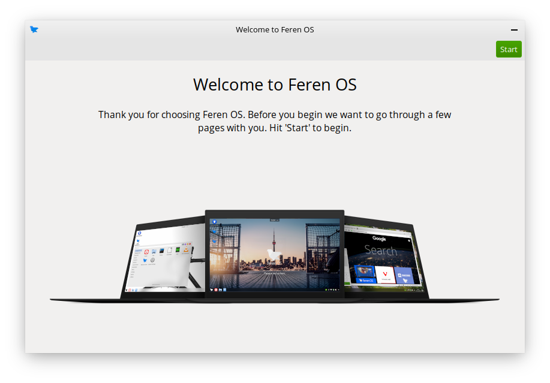

First Steps
==================

Logging in for the first time
----------------

At this point of the guide, it is assumed you have just booted into your new Feren OS installation and just logged in. Welcome to Feren OS! Before you can start using Feren OS, Feren OS wants to ask you a few quick questions when you log in for the first time about how you want your desktop to look and if you want to set a few extra features up to improve your user experience.

When you log in, you will see a dialog greeting you to Feren OS, ready to ask you a few questions. It will look similar to the dialog depicted below:

When you see this dialog, press :guilabel:`Next` to continue through each page after you have looked at each page. You are free to choose whatever option suits you on each page, as well as skip over pages shown to you.

Here's a quick description of each page:

* Virtual Machine - Install VirtualBox Guest Additions or VMWare Tools if necessary (only shown on Virtual Machines)
* Codecs - Install third-party multimedia codecs to your new Feren OS installation (if your country serves Windows N or similar then skip this step)
* Look and Feel - Choose a layout to start off with on Feren OS
* Theme Mode and Accent Colour - Choose Default, Light Mode or Dark Mode and then choose an optional accent colour if desired
* Pair Feren OS with your Android Device - Set up KDE Connect on Feren OS and your Android Device
* Reduce eye strain at night - Set up Night Colour, a feature to reduce blue light on your screen to reduce eye strain in dark environments

Feren OS Classic has a different set of steps, however:

* Virtual Machine - Install VirtualBox Guest Additions or VMWare Tools if necessary (only shown on Virtual Machines)
* Codecs - Install third-party multimedia codecs to your new Feren OS installation (if your country serves Windows N or similar then skip this step)
* Layout - Choose a layout to start off with on Feren OS
* Theme Mode and Accent Colour - Choose Default or Dark Mode and then choose an optional accent colour if desired
* Toggle Animations - Enable or disable animations in Feren OS Classic

Once you are done you will see a final thank you page and then the window will close when you click :guilabel:`Enjoy`.

Now that is done, `Welcome Screen <https://feren-os-user-guide.readthedocs.io/en/latest/welcomescreen.html>`_ should appear next. Check out the Welcome Screen if you want some extra advice on some things you can do in Feren OS and then feel free to set up Feren OS however you want.

.. warning::
    If you backed up data earlier using Transfer Tool before replacing your previous Operating System with Feren OS, don't forget to follow the steps on `Restoring data with Transfer Tool <https://feren-os-user-guide.readthedocs.io/en/latest/transfertoolrestore.html>`_ before you start setting up your desktop. If you restore data with Transfer Tool after setting up, it may override some of your settings during data restoration.
