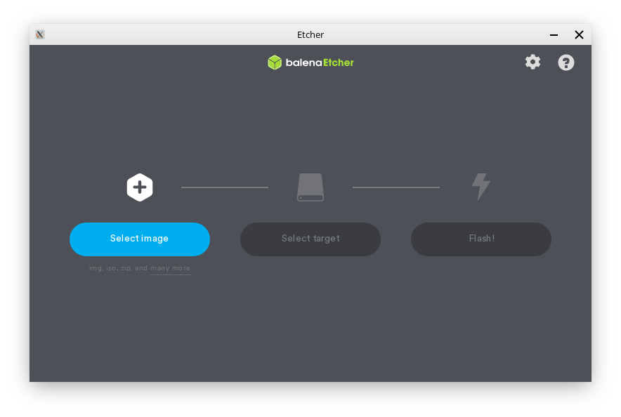

Flashing to a USB Stick
==================

Getting the necessary tools
----------------

Before you can flash your new Feren OS ISO download to a USB Stick, you'll need a program called ``balenaEtcher`` to flash Feren OS to a USB of your choosing.

You can get balenaEtcher for your machine at https://www.balena.io/etcher/

.. hint::
    Make sure to get the 64-bit version of balenaEtcher.

Once you have downloaded balenaEtcher for your platform, set it up so that you see a window similar to the one shown in the image above.

.. hint::
    For Linux (and Feren OS) you will want to make the .AppImage file that you downloaded executable in its properties (:menuselection:`right-click the balenaEtcher .AppImage file --> Properties --> Permissions`) so that you can open the file normally.
    For Windows you will need to install balenaEtcher first unless you have downloaded the portable version instead.

Flashing Feren OS to your USB
-------------------------------------

.. warning::
    If you have data on the USB drive you want to flash Feren OS onto, back it up elsewhere or else it will be permanently lost when you flash your Feren OS ISO file onto it.

To flash Feren OS to a USB:

1. Plug in your USB

2. Open balenaEtcher

3. Click :guilabel:`Select image` and select the Feren OS ISO file you downloaded

4. Click :guilabel:`Select target` and select your USB and then hit Continue

5. Click :guilabel:`Flash!` and authenticate if required

This process may take a while, but once you are done you can move on to the next step appropriate to your circumstances from the sidebar to the left of this User Guide.