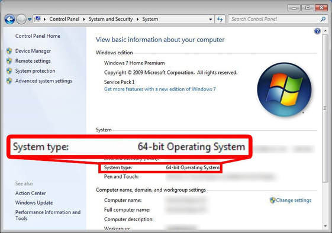
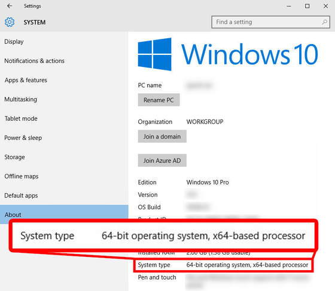
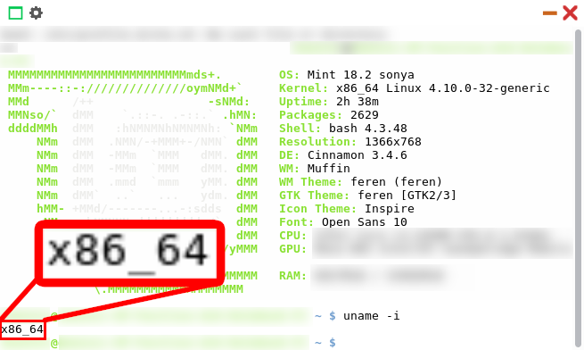

Getting the correct Feren OS for your machine
==================

Checking your system architecture to find the correct Feren OS
----------------

Different machines have different 'architectures' in it. These architectures decide a lot about what can run on your machine(s) and what cannot. Therefore, the same applies for what version of Feren OS can run on your machine.

Different Operating Systems have different ways to tell you what architecture your system is using. As a general rule of thumb most modern hardware is 64-Bit, however it is best to be certain before you potentially waste an ISO download downloading the 64-Bit version of Feren OS only for your machine to be incompatible.

Finding out the architecture in Microsoft Windows XP and older
----------------

Unless you are using the 64-Bit Edition of Windows XP, you are running on a 32-Bit Operating System.

Therefore, you should download ``Feren OS Classic 32-Bit`` for your machine.

Finding out the architecture in Microsoft Windows Vista - 8.1
----------------

To find out the architecture of your system, go into :menuselection:`Control Panel --> System & Security --> System`. From there look for a label saying "System type".

If the label says "64-bit Operating System", you should download either ``Feren OS`` or ``Feren OS Classic 64-Bit`` for your machine.

If the label says "32-Bit Operating System", you should download ``Feren OS Classic 32-Bit`` for your machine.

Finding out the architecture in Microsoft Windows 10
----------------

To find out the architecture of your system, go into :menuselection:`Settings --> System`. From there look for a label saying "System type".

If the label says "64-bit Operating System", you should download either ``Feren OS`` or ``Feren OS Classic 64-Bit`` for your machine.

If the label says "32-Bit Operating System", you should download ``Feren OS Classic 32-Bit`` for your machine.

Finding out the architecture in Apple macOS
----------------

A general rule of thumb is that the modern macOS releases are 64-Bit only. Especially if you are running Catalina or newer, you're very likely on 64-Bit hardware meaning that you should download either ``Feren OS`` or ``Feren OS Classic 64-Bit`` for your machine.

To be sure, open a Terminal window and run 'uname -a' in there. An x86_64 string in the output of that command means you're on 64-Bit macOS. Similarly, an i686 string in the output of that command means you're on 32-Bit macOS, meaning that you should download ``Feren OS Classic 32-Bit`` for your machine.

Finding out the architecture in Linux
----------------

To check the architecture in Linux, open up a Terminal and run 'uname -i' in there.

If the output says 'x86_64' then you should download either ``Feren OS`` or ``Feren OS Classic 64-Bit`` for your machine. However if the output says 'i686' then you should download ``Feren OS Classic 32-Bit`` for your machine.

What version of Feren OS is right for me?
----------------

The correct version of Feren OS for you depends on your system and your preferences.

If you have a 32-Bit system, then ``Feren OS Classic`` is the best option for you. However, if you have a 64-Bit system, it all depends on preference between the following:

- ``Feren OS`` is the leaner, more polished version of Feren OS. It's the defacto Feren OS meaning that it is guaranteed to get the most maintenance done to it and that it is guaranteed to be maintained longer than Classic will, with an indefinite maintenance time until a possible desktop environment switch some time in the future.

- ``Feren OS Classic`` is the original Feren OS experience with the Cinnamon Desktop. It is heavier than Feren OS on resources by default however it has seen more development time overall and is more stagnant with updates than Feren OS due to its maturity.

I'd recommend ``Feren OS`` for newcomers to Feren OS because of its defacto status and its overall higher levels of polish, however the choice is always yours in the end.
