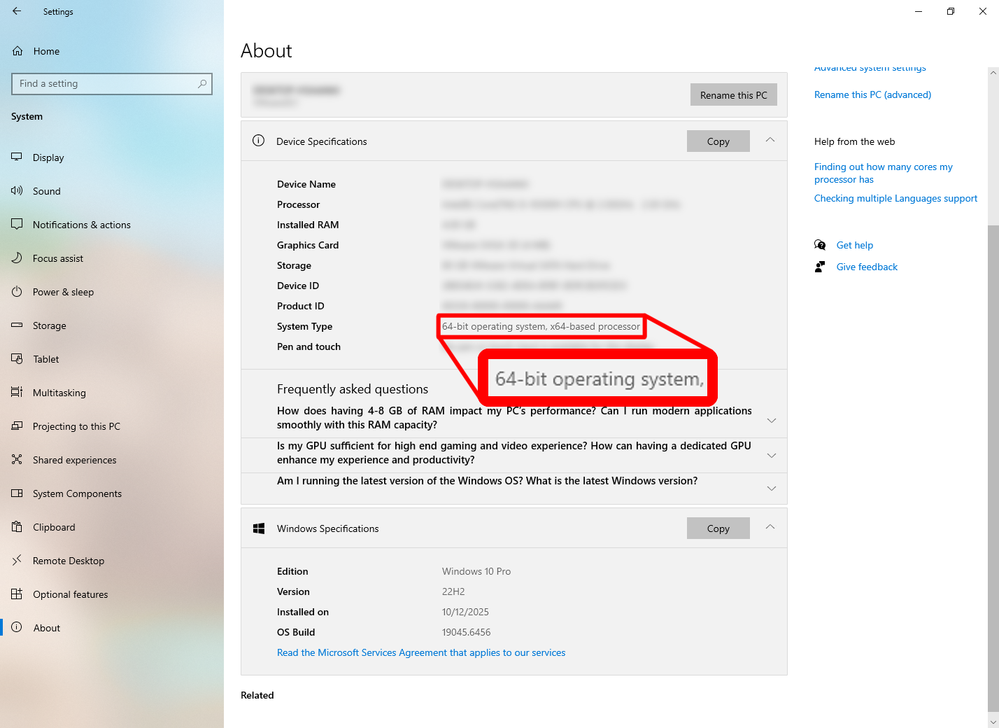
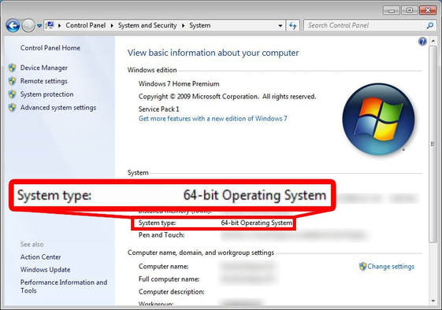
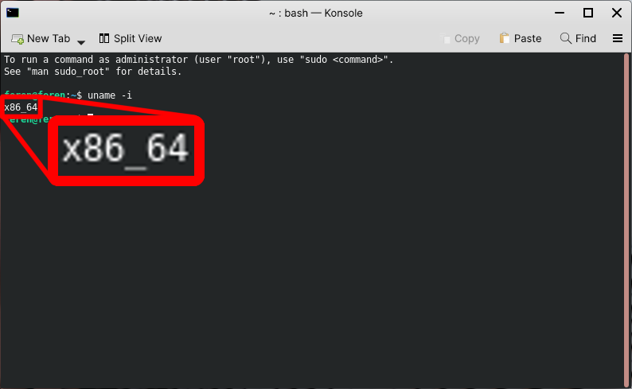

Checking Feren OS is compatible with your machine
==================

Different machines have different "architectures". These architectures decide a lot about what can run on your machine(s) and what cannot, including if Feren OS can run on your machine.

You can identify if Feren OS can run on your machine or not by identifying if your machine is 64-bit or not with the steps below:

I'm using Microsoft Windows 11
----------------

Check the default themes in :menuselection:`Settings --> Personalisation` - if there is one that has a blue tissues-like background, you're good to go - Windows 11 is always 64-Bit meaning you have 64-Bit hardware and can therefore download Feren OS for your machine.

If you instead see a rainbow tissues-like background, Feren OS is not yet compatible with your machine as it uses the ARM architecture.

I'm using Microsoft Windows 10
----------------

To find out the architecture of your system, go into :menuselection:`Settings --> System --> About`. From there look for a label saying ``System Type``.

If the label says "64-bit Operating System", you're good to go! You can download Feren OS for your machine.

If the label says "32-Bit Operating System", Feren OS is likely not compatible with your machine - you can still attempt to download Feren OS, however it may fail to boot and instead tell you ``This kernel requires an x86-64 CPU, but only detected an i686 CPU``.

I'm using Microsoft Windows Vista, 7, 8 or 8.1
----------------

To find out the architecture of your system, go into :menuselection:`Control Panel --> System & Security --> System`. From there look for a label saying ``System type``.

If the label says "64-bit Operating System", you're good to go! You can download Feren OS for your machine.

If the label says "32-Bit Operating System", Feren OS is likely not compatible with your machine - you can still attempt to download Feren OS, however it may fail to boot and instead tell you ``This kernel requires an x86-64 CPU, but only detected an i686 CPU``.

I'm using Microsoft Windows XP and older
----------------

If your machine is running "Windows XP Professional x64 Edition", you're good to go! You can download ``Feren OS`` for your machine.

If not, you are running on a 32-Bit Operating System and Feren OS is likely not compatible with your machine - you can still attempt to download Feren OS, however it may fail to boot and instead tell you ``This kernel requires an x86-64 CPU, but only detected an i686 CPU``.

I'm using an Apple Mac device
----------------

.. warning::
    If your device is powered by an "M1 Chip" or later, Feren OS is not yet compatible with your machine as it uses the ARM architecture.

A general rule of thumb is that the modern macOS releases are 64-Bit only. Especially if you are running Catalina or newer, you're very likely on 64-Bit hardware meaning that you can download ``Feren OS`` for your machine.

To be sure, open a Terminal window, type ``uname -a`` in there and press ENTER.

If you see ``x86_64`` in the text displayed afterwards, you're good to go! You can download Feren OS for your machine.

If you see ``i686`` instead, Feren OS is not compatible with your machine.

Finding out the architecture in Linux
----------------

To check the architecture in Linux, open up a Terminal and run ``uname -i`` in there.

If you see ``x86_64`` in the text displayed by that command, you're good to go! You can download Feren OS for your machine.

If you see ``i686`` instead, Feren OS is not compatible with your machine.

