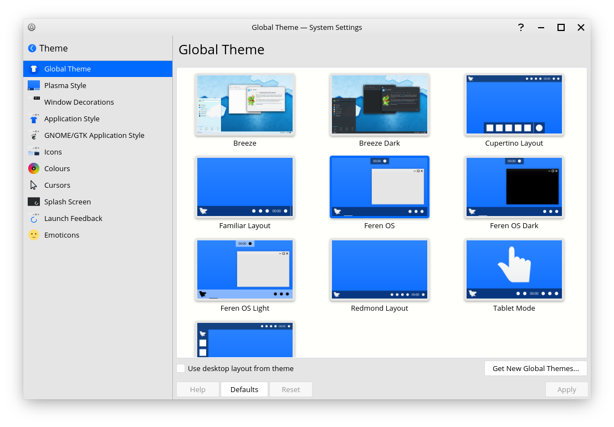

Global Theme
==================

.. hint::
    This guide doesn't work on Feren OS Classic. For Feren OS Classic you need to use :menuselection:`System Settings --> Theme` instead, and you can get new themes from :menuselection:`Store --> Customisation --> Themes`.

What are Global Themes?
----------------

Global Themes are theme packs for Feren OS and other distributions with the Plasma desktop. They provide a layout for your desktop and set many parts of the way your Feren OS desktop looks all in one go.

You can find Global Theme in :menuselection:`System Settings --> Theme --> Global Theme`.

.. hint::
    You can apply just the theming and not also the desktop layout when applying Global Themes. To do so select the Global Theme you want to apply, untick the checkbox saying :guilabel:`Use desktop layout from theme` and then click :guilabel:`Apply`.

    Global Theme

To apply a Global Theme, select it and then click :guilabel:`Apply`.

Getting new Global Themes
-------------------------------------

To get a new Global Theme, go into Global Theme and click :guilabel:`Get New Global Themes...` at the bottom-right above :guilabel:`Apply`. A window will now pop up allowing you to install and remove a variety of Global Themes made by the community.

To install Global Themes, simply find the theme you want, click :guilabel:`Install` for that theme, let it install and then when you're done close the window and Global Theme should now populate with themes that were successfully installed.