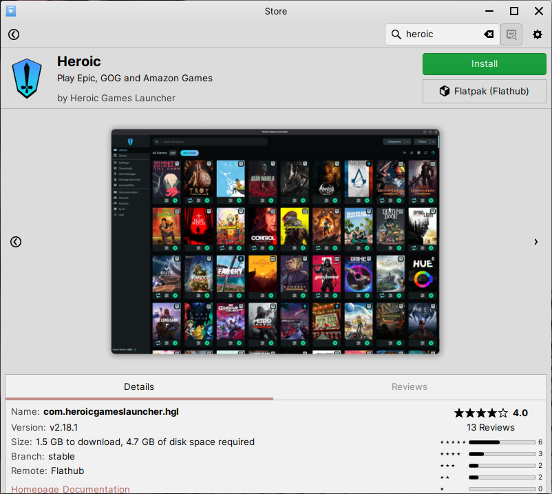

Heroic
==================

Heroic is a game manager that provides a unified replacement game launcher for games from the Epic Games Store, GOG and Amazon Games.

You can get Heroic right from the Store. To find it in Store, do the following:

1. Open Store

2. Go to the :guilabel:`Flatpak` category

3. Select :guilabel:`Heroic`

4. Click :guilabel:`Install` on the Bottles page in Store

.. hint::
    Can't find Heroic in the applications listed? Just use the search bar at the top right to search for it instead.

    Heroic in Store

Getting help with Heroic
-------------------------------------

You can get help with using Heroic from the following websites:

* `Getting started with Heroic <https://github.com/Heroic-Games-Launcher/HeroicGamesLauncher/wiki>`_
* `Report a bug in Heroic <https://github.com/Heroic-Games-Launcher/HeroicGamesLauncher/issues>`_