Installing Feren OS alongside Windows
==================

.. hint::
    Before you start this guide, you'll want to boot into the Feren OS USB or DVD you flashed earlier. For guidance on booting into your USB or DVD `follow this guide and then come back to this guide once you've booted in <https://feren-os-user-guide.readthedocs.io/en/latest/livecdboot.html>`_.

.. warning::
    This guide also expects you made some room beforehand for Feren OS on your hard drive using the guide here: `Making preparations in Windows <https://feren-os-user-guide.readthedocs.io/en/latest/preparations/prepwindows.html>`_. If you have not done this yet then you should follow this guide first and then return to this guide.

Opening the installer
----------------

To start installing Feren OS you will want to run the installer. The installer is placed in the following locations:

- The :guilabel:`Install Feren OS` shortcut placed on the desktop

- The :guilabel:`Install Now` button in Welcome Screen

- Applications Menu (bottom-left bird icon) --> :guilabel:`System` --> :guilabel:`Install Feren OS`

Installing Feren OS (Feren OS and Feren OS Classic 64-Bit)
----------------

Once you have the installer opened up you should see a screen similar to the one shown in the below image:

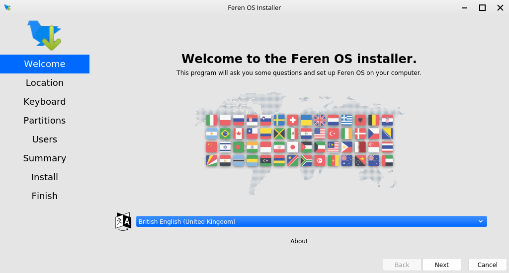

    Feren OS's installer

Now you are in the installer, select your language using the dropdown menu at the bottom of the window and then press :guilabel:`Next`.

You should now see a location select screen. From here either click where you are on the world map or use the dropdown menus below the map to select your region and zone. This will be used to set the timezone, currency, and so on on the installed Feren OS machine.

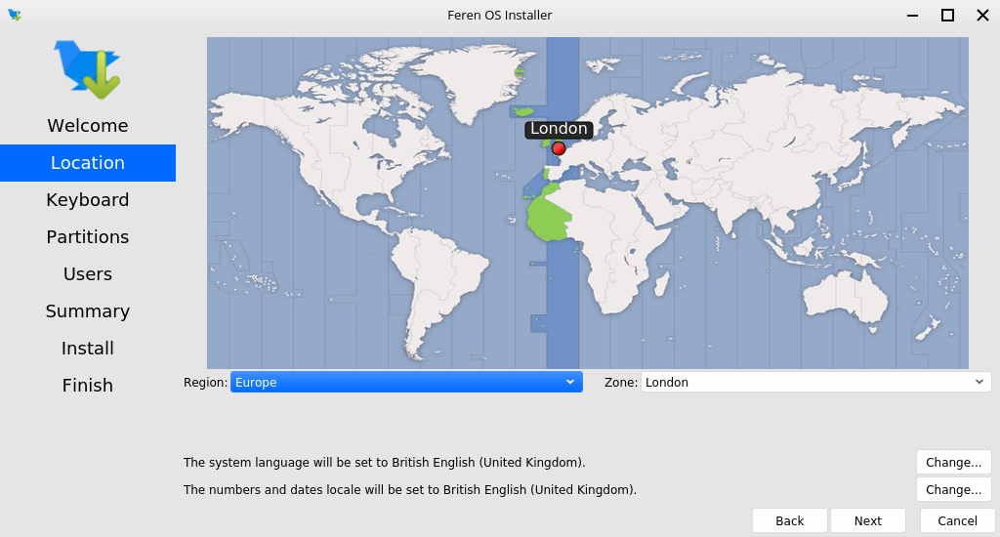

Once you've set your location click :guilabel:`Next` again.

Next you will see a diagram of a keyboard at the top of the window. Below that is a keyboard model setting and a keyboard layout list. Select a keyboard model if required (not usually required) and then select your keyboard layout using the list of layouts in the bottom two boxes.

.. warning::
    Make sure to set the correct keyboard layout for your machine and just to be sure type using the textbox at the bottom to test if your choice of keyboard layout matches with your keyboard keys.

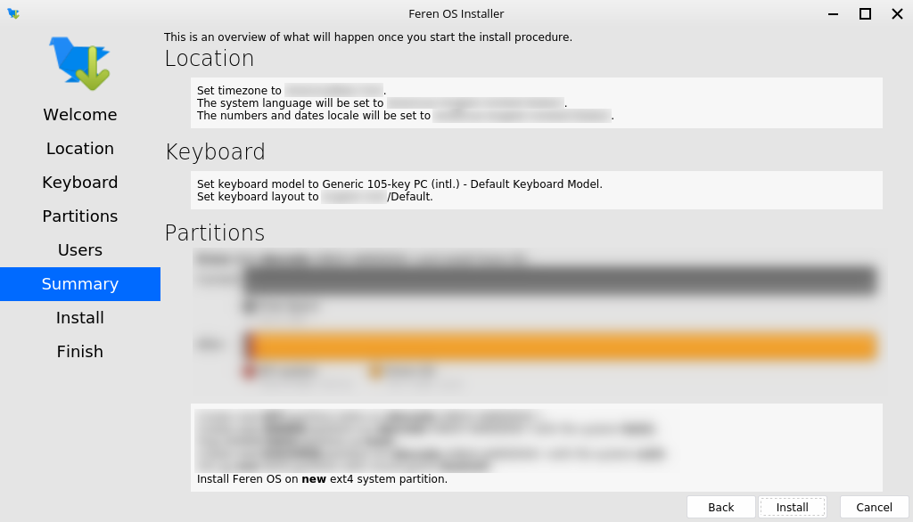

Once you've set your keyboard layout click :guilabel:`Next` once more.

Now you'll have the option to either erase your disk, replace a partition with Feren OS, install Feren OS alongside your current Windows partition or partition Feren OS manually. Select :guilabel:`Replace a partition` and then click the "Free Space" that you generated by shrinking the Windows partition earlier on the "Current" partition bar at the bottom of the window. After doing that, click :guilabel:`Next`.

.. warning::
    Be sure to check the dropdown menu at the top of this screen to make sure it has selected the correct disk to install Feren OS onto. Better safe than sorry.

.. hint::
    There may be more than one Free Space item on the partition bar. Make sure you select the one you created earlier when you shrank Windows. It will always be on the right of the Windows installation's "NTFS" partition.

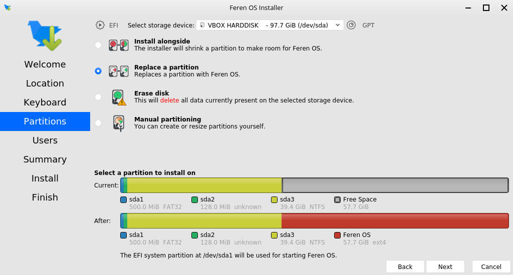

Now you'll be taken to a page where you can create a new user for your soon-to-be Feren OS installation. Type your desired full name, your desired username, your desired computer name and the password you want for the first user account on your soon-to-be Feren OS installation.

.. hint::
    The username can only contain lowercase letters and numbers. The full name however is more flexible.

.. figure:: images/calamares4.png
    :width: 1024px
    :align: center

There will also be an optional checkbox below the password textboxes saying :guilabel:`Log in automatically without asking for the password`. If you want Feren OS to log in automatically to your machine on boot then tick this checkbox.

.. warning::
    Enabling this option causes a security risk for your data on that user as anyone can then boot into your machine and immediately have access to your personal files and other data.
    
Once you've done this, press :guilabel:`Next` once more.

Now you'll be taken to a page that summarises what will be done during installation. This will allow you to look over what you have chosen for your new Feren OS installation before installation begins.

.. figure:: images/calamares5.png
    :width: 1024px
    :align: center

Once you're sure you've got everything correct, click :guilabel:`Install` and then :guilabel:`Install now` on the final confirmation dialog.

.. warning::
    Once you have hit :guilabel:`Install now` there is no going back to change the installation settings. Make sure you've got everything just the way you want it before you confirm beginning the installation.

Feren OS will now be installed. Have a cup of coffee or something as Feren OS will take a little while to install onto your machine.

Once Feren OS has finished installing, it'll take you to a screen saying "All Done". From here you can choose whether you want to immediately reboot into your new Feren OS installation when you click :guilabel:`Finish` or not.

.. figure:: images/calamares6.png
    :width: 1024px
    :align: center

Congrats, you have installed Feren OS! When rebooting eject your USB or DVD and press :kbd:`Enter` on your keyboard when Feren OS prompts you to :guilabel:`remove your installation medium, then press ENTER`.

Installing Feren OS (Feren OS Classic 32-Bit)
-------------------------------------

Feren OS Classic 32-Bit has a different installer as the installer used in other ISOs does not support Feren OS Classic 32-Bit currently. As such, the steps are slightly different.

Once you have the installer opened up you should see a screen similar to the one shown in the below image:

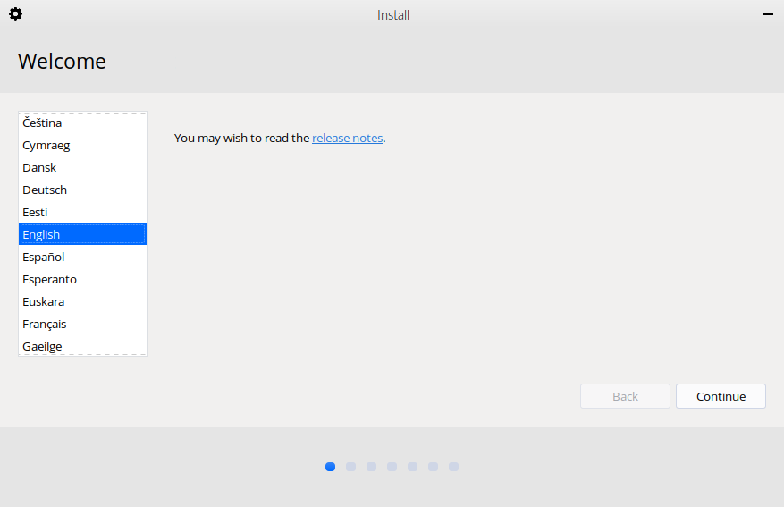

    Feren OS Classic 32-Bit's installer

Now you are in the installer, select your language using the list of languages at the left of the window and then press :guilabel:`Continue`.

You'll now be taken to a screen to choose your keyboard layout. You can either click the :guilabel:`Detect Keyboard Layout` button at the bottom or you can manually select your keyboard layout from the two boxes at the top.

.. warning::
    Make sure to set the correct keyboard layout for your machine and just to be sure type using the textbox at the bottom to test if your choice of keyboard layout matches with your keyboard keys.

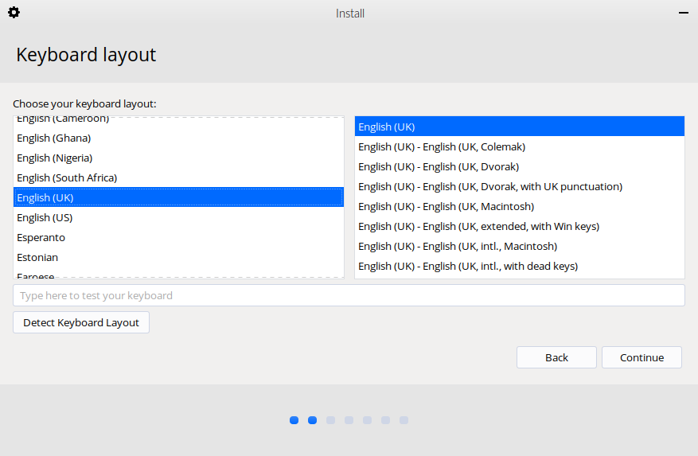

Once you've done that, click :guilabel:`Continue`.

You will now be taken to a screen where you can choose to either :guilabel:`Download updates while installing Feren` OS, :guilabel:`Install third-party software for graphics and Wi-Fi hardware and additional media formats` or both. Once you've ticked the checkboxes you want to tick, click :guilabel:`Continue`.

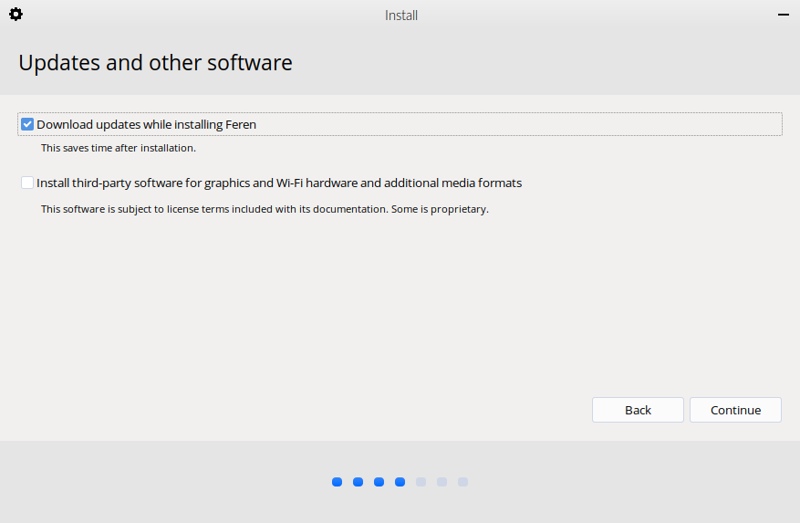

You will now be taken to a screen where you can select whether you want to :guilabel:`Install Feren alongside Windows`, :guilabel:`Erase disk and install Feren` OS or do :guilabel:`Something else` to manually partition Feren OS yourself. Select :guilabel:`Something else` and click :guilabel:`Continue`.

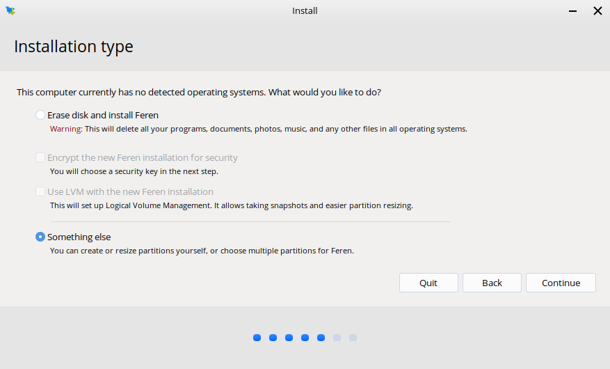

You will now be taken to a screen to partition your drives manually. From here you want to do the following:

1. Select the "free space" that you made earlier when you shrank the Windows partition in the list of partitions and then click :guilabel:`+`.

.. hint::
    The free space you made earlier will always be below the Windows partition, which will be identified as an 'ntfs' partition and will be the size you shrank Windows to earlier.

2. A dialog will now pop up. Click the :guilabel:`Use as` dropdown menu and select :guilabel:`Ext4 journaling file system`.

3. Click the :guilabel:`Mount point` dropdown menu and select "/".

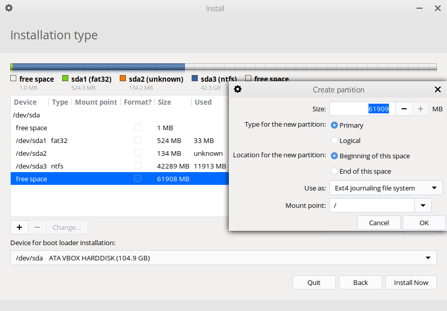

4. Click :guilabel:`OK`.

5. You may then see a dialog about writing changes to disk. If you do, click :guilabel:`Continue` on that dialog.

6. Once the partition list is refreshed, click the :guilabel:`Device for boot loader installation` dropdown menu at the bottom and then select the hard drive you have Windows installed on currently if it is not already selected.

7. Now click :guilabel:`Install Now` after you've done partitioning.

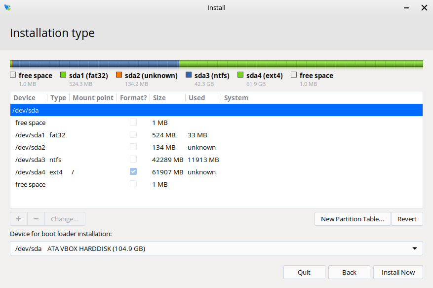

You will now get a final summary dialog explaining what is going to happen to your disk. When you are ready, click :guilabel:`Continue`.

.. warning::
    Once you have hit :guilabel:`Continue` there is no going back to change the installation settings. Make sure you've got everything just the way you want it before you confirm beginning the installation.

You will now be taken to a screen where you can select where you are on the world map. Either click where you are on the world map or type in the textbox directly below the world map to select a timezone and then click :guilabel:`Continue`.

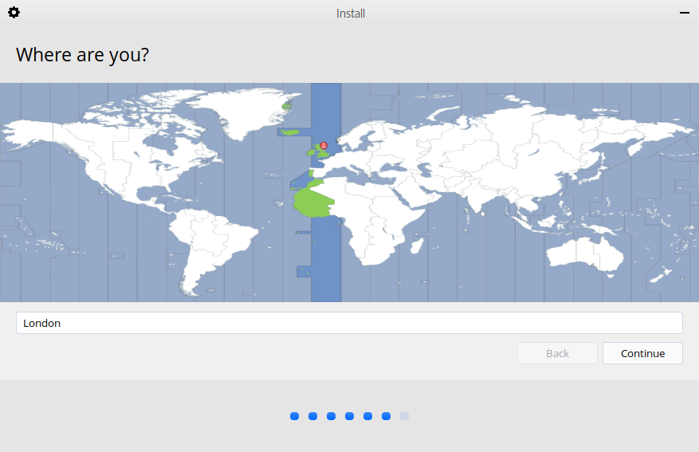

You will then be taken to a screen where you can configure your user account for your new Feren OS installation. Fill out each textbox with what you want and then optionally select :guilabel:`Log in automatically` if you want Feren OS to log in immediately to your user account automatically when booting up.

.. hint::
    The username can only contain lowercase letters and numbers.

.. warning::
    Selecting :guilabel:`Log in automatically` causes a security risk for your data on that user as anyone can then boot into your machine and immediately have access to your personal files and other data.

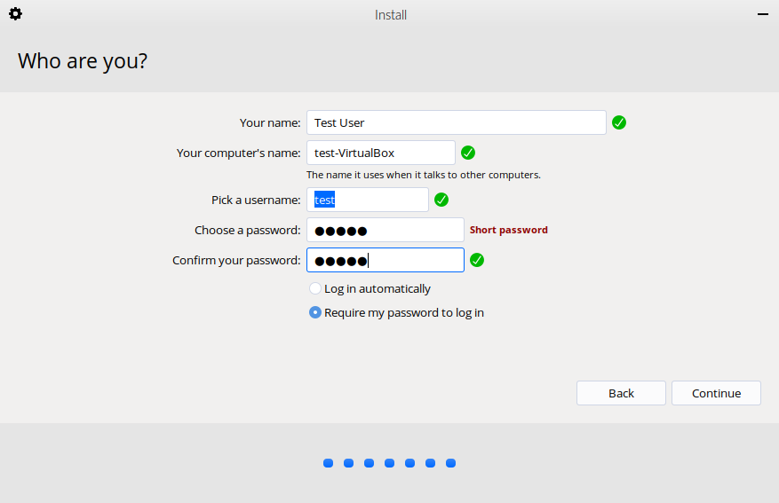

When you're done, click :guilabel:`Continue` one last time.

Feren OS will now be installed. Have a cup of coffee or something as Feren OS will take a little while to install onto your machine.

Once Feren OS has finished installing, the installer will close and a dialog will appear telling you that installation has finished. From here you can click either :guilabel:`Continue Testing` to not restart immediately into your Feren OS installation or click :guilabel:`Restart Now` to restart immediately into your Feren OS installation.

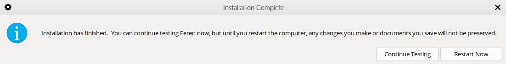

Congrats, you have installed Feren OS! When rebooting eject your USB or DVD and press :kbd:`Enter` on your keyboard when Feren OS prompts you to :guilabel:`remove your installation medium, then press ENTER`.

Next Steps
-------------------------------------

- `First Steps <https://feren-os-user-guide.readthedocs.io/en/latest/firststeps.html>`_