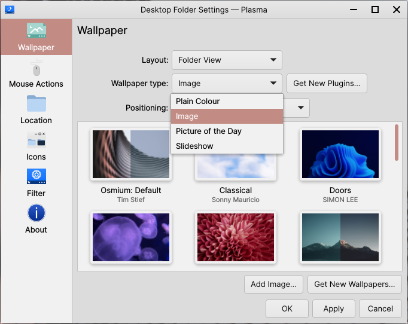

Get New...
==================

You can get new Global Themes, Plasma Styles, Colour Schemes, Window Decorations, Icons and Cursors by the community from System Settings.

To do so, navigate to the respective page of :menuselection:`System Settings --> Appearance` and click :guilabel:`Get New _...` at the bottom-right. Then, explore the vast selection of community-made content to your desire, :guilabel:`Install` anything that interests you, and return to System Settings to select and apply your new content.

.. warning::
    All the content from Get New... mentioned in this page of the User Guide is provided by a 3rd-party service called Pling. Pling is not endorsed nor managed by Feren OS, meaning its content is fully managed by Pling and some KDE moderators, not Feren OS. Feren OS developers do not accept responsibility for damage caused as a result of content downloaded from this service.

Wallpapers and Wallpaper Plugins
-------------------------------------

Wallpapers can also be obtained from this service. To do so, `open the wallpaper selector <https://feren-os-user-guide.readthedocs.io/en/latest/wallpaper.html>`_ and then click :guilabel:`Get New Wallpapers...` to start browsing through wallpapers posted on Pling.

Images aren't the only type of wallpaper you can use. Above the selection of wallpapers that you've installed/added or are built-in, clicking the :guilabel:`Wallpaper type` dropdown allows you to change the plugin used for the wallpaper, be it to a solid colour, or a slideshow of wallpapers.

That said, you can get even more Wallpaper Plugins, made by the community, by clicking on the :guilabel:`Get New Plugins...` button to the right of the dropdown.

    Initial selection of Wallpaper Plugins

.. hint::
    You may need to close and reopen the Desktop Settings window for new Wallpaper Plugins to appear.