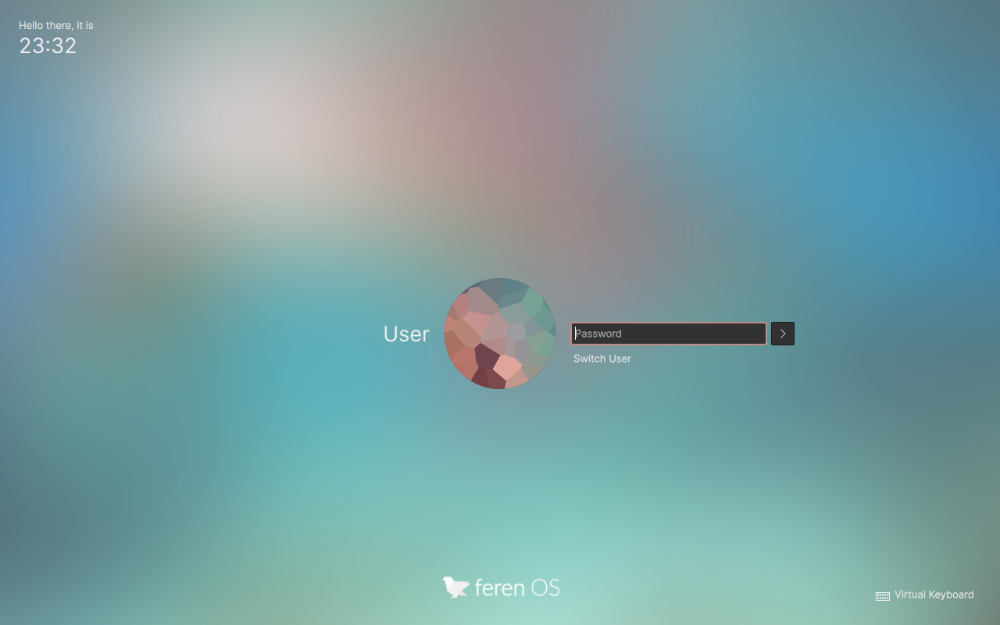

Lock Screen
==================

Feren OS comes built-in with a lock screen - it looks like this:

However you can tweak the way the lock screen looks. To do this, go into :menuselection:`System Settings --> Workspace Behaviour --> Screen Locking`.

From here, you can customise when to lock the screen, what keyboard shortcut locks the screen, and even change its `wallpaper <https://feren-os-user-guide.readthedocs.io/en/latest/wallpaper.html>`_ and additional lock screen functionality from the :guilabel:`Configure...` button beside :guilabel:`Appearance`.