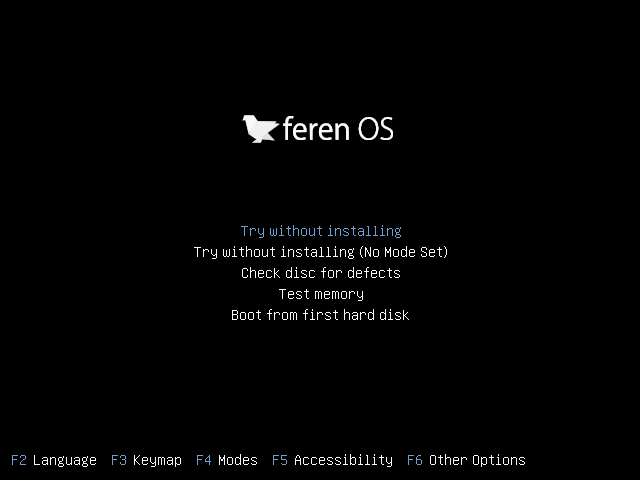
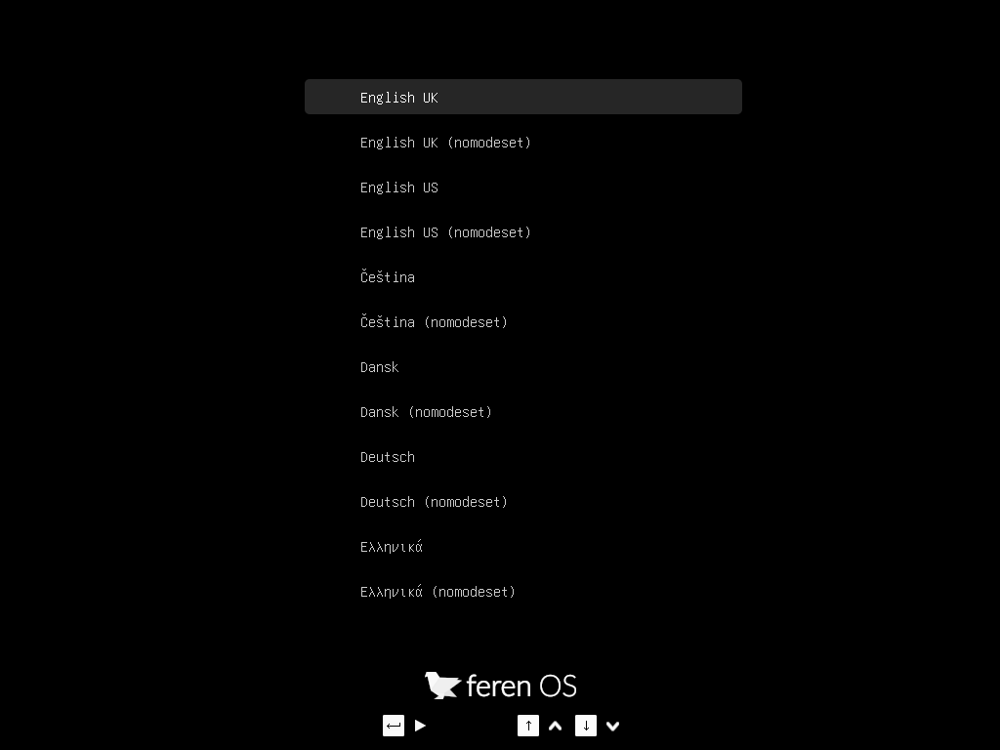

Boot Feren OS from USB or DVD
===============

Now that you have Feren OS on a USB stick (or DVD) boot the computer from it.

1. Insert your USB stick (or DVD) into the computer.

2. Restart the computer.

3. Before your computer boots your current operating system (Windows, Mac, Linux) you should see your `BIOS <https://en.wikipedia.org/wiki/BIOS>`_ loading screen. Check the screen or your computer's documentation to know which key to press and instruct your computer to boot on USB (or DVD).

.. note::
	Most BIOS have a special key you can press to select the boot device and all of them have a special key to enter the BIOS configuration screen (from which you can define the boot order). Depending on the BIOS, these special keys can be :kbd:`Escape`, :kbd:`F1`, :kbd:`F2`, :kbd:`F8`, :kbd:`F10`, :kbd:`F11`, :kbd:`F12`, or :kbd:`Delete`. That information is usually briefly written on the screen during the boot sequence.

.. hint::
	On Macs, keep your finger pressed on the :kbd:`Alt` or :kbd:`Option` key after pressing the power on button.

4. The Feren OS ISO can be booted both in EFI, BIOS or CSM/Legacy Boot mode. In EFI mode it shows a grub menu. In BIOS or CSM/Legacy Boot mode it shows an isolinux menu that can be seen by pressing any key during the initial Feren OS logo.

    The isolinux menu in BIOS mode

    The grub menu in EFI mode

5. From one of these menus scroll down with the arrow keys to the appropriate boot option and press :kbd:`Enter` to start Feren OS from your USB stick (or DVD).

.. hint::
    The arrow keys (four pointing arrow keys) on your keyboard let you change what option you are currently selecting in both menus. Pressing the :kbd:`Enter` key will start the option you selected.

Booting with 'nomodeset' (for NVIDIA users)
-------------------------------------

If you have NVIDIA Graphics on your device, you may run into graphical issues when booting into Feren OS normally as the correct drivers for your hardware are not present by default in Feren OS.

However, there is a quick workaround. In both boot menus there is an option called "nomodeset". If you're having problems with booting Feren OS normally on NVIDIA hardware then simply select the :guilabel:`No Mode Set` option instead and Feren OS should boot, albeit with some graphical deficiencies compared to what it looks like once properly installed and with the correct drivers installed onto it.

If you need to boot with No Mode Set then please refer to `Booting with nomodeset for NVIDIA Hardware <https://feren-os-user-guide.readthedocs.io/en/latest/nomodesetboot.html>`_ after you have installed Feren OS to boot into your Feren OS installation for the first time without issues.
