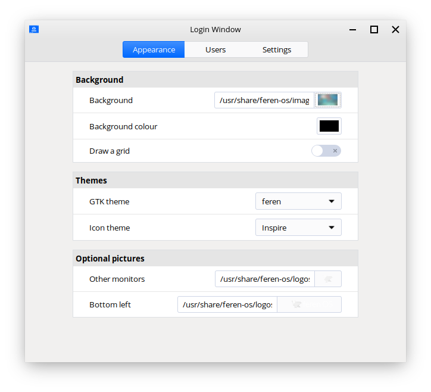

Customising the Login Screen
==================

Login Window
----------------

To change login screen related settings, you will want to open up Login Window.

.. warning::
    Only those with administrative privileges or those who can obtain these privileges can open Login Window.

Login Window can be opened via :menuselection:`Applications Menu --> Settings / Preferences --> Login Window`.

    Login Window

The following is a list of what each setting does:

Appearance:

* Background: Sets the background image on the login screen
* Background colour: Fallback background color used in case the image can't be used
* Draw a grid: Draw a grid pattern over the login screen background
* GTK theme: Sets the application style used in the login screen
* Icon theme: Sets the icon theme used in the login screen
* Other monitors: Sets the logo that appears in the center of extra monitors (if applicable) that do not have the mouse in them
* Bottom left: Sets the logo that appears at the bottom left of the login screen

Users:

* Allow manual login: Allows users to manually type in their username and password to log in
* Hide the user list: Hides the user list making it so you have to type your username and password to login (useful on school or business machines)
* Allow guest sessions: Allows Guest Session login (currently contains security issues)
* Username: The user that you want to automatically log into when booting into Feren OS
* Delay before connection: Time before the user is automatically logged in when booting into Feren OS

Settings:

* Activate numlock: Automatically activate numlock on the login screen
* HIDPI support: Enable higher DPI scaling on the login screen (for screen resolutions so large that you need to scale the stuff on screen up to be able to read it)
* Monitor: Set monitor type (I personally would never touch this setting)

Panel indicators:

* Hostname: Toggle the text at the top-left of the login screen
* Accessibility options: Toggle the accessibility options icon and menu visibility
* Battery power: Toggle the battery status icon visibility
* Keyboard layout: Toggle the keyboard layout changer visibility
* Clock: Toggle the clock visibility
* Quit menu: Toggle the power menu visibility

Feren OS Classic exclusives - Appearance:

* Draw user backgrounds - show the background the user you're currently on is using on their desktop on the login screen