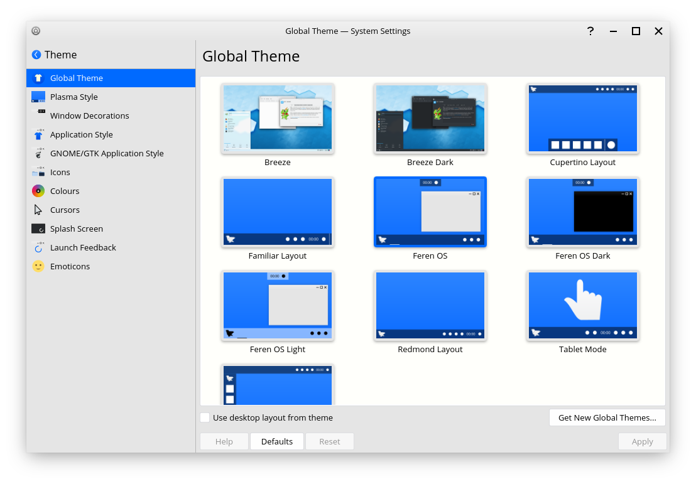

Global Theme
==================

What are Global Themes?
----------------

Global Themes are theme packs for Feren OS and other distributions with the Plasma Desktop. They provide a layout for your desktop and set many parts of the way your Feren OS desktop looks all in one go.

You can find Global Theme in :menuselection:`System Settings --> Appearance --> Global Theme`.

When selecting a Global Theme, if it has a Desktop Layout included you will get the option to pick what parts of the Global Theme are applied.

    Global Theme

When you've selected the parts you want changed, click :guilabel:`Apply` to apply the selected changes.