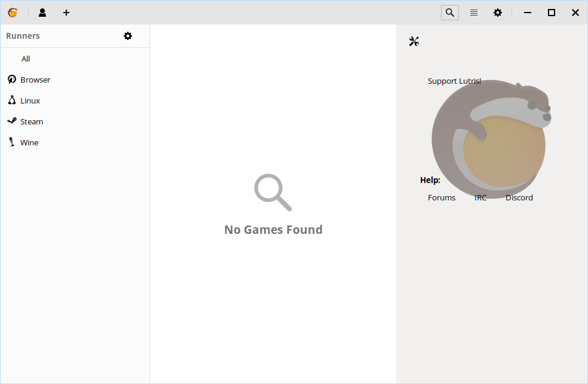

Lutris
==================

What is Lutris?
----------------

Lutris is a small but very famous project designed to make game management on Feren OS and other Linux Distributions way easier by grouping all the games from all the popular video game distribution services and more into one single place, as well as providing easy ways, from the community, to install these games.

    Lutris when launched for the first time

To install Lutris, just like with Steam simply do the following:

1. Open Store

2. Go to the :guilabel:`Games` category

3. Select :guilabel:`Lutris` from the :guilabel:`All` subcategory

4. Hit :guilabel:`Install` on the Lutris page in Store

.. hint::
    Can't find Lutris in the haystack of applications listed? Just use the search bar at the top right to search for it instead.

Getting started with Lutris
-------------------------------------

To start using Lutris, you'll need to get the grasp of how the basics of how it works.

The most important feature of Lutris is installing games. To install a game with Lutris you have two options:

* Search Lutris.net right from the application - click the magnifying glass icon on the top-right of the Lutris window, type the name of the game you want to install and then click :guilabel:`Search Lutris.net`
* Search https://lutris.net/games right from your web browser - when you've found the game you want to install, click the :guilabel:`Install` button on the website for that game and allow "xdg-open" to be opened to continue the installation process in Lutris

Now you know that, don't be afraid to explore Lutris. The rest of Lutris is fairly intuitive, after all. 

If you need more help, check out Lutris's website at https://lutris.net for useful links and social media links.

Extra Tips
-------------------------------------

If you have Steam, I'd recommend integrating Lutris through Steam by signing up to Lutris.net and linking that to your Steam account to make your Steam Library appear in Lutris when signed in there too, and also recommend integrating Lutris into Steam using this guide: https://github.com/lutris/lutris/wiki#steam. It's entirely optional, but it improves the overall experience.