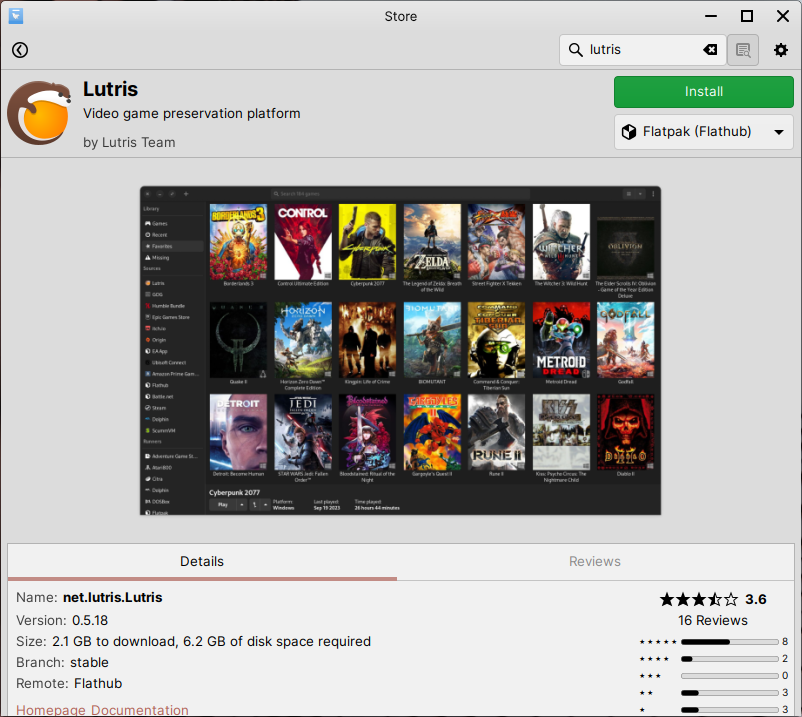

Lutris
==================

Lutris is a project that provides a central video game management experience on Feren OS and other Linux Distributions, and a streamlined game installation experience that is powered by installation scripts, made by the community, that are specifically coded for each available game.

You can get Lutris right from the Store. To find it in Store, do the following:

1. Open Store

2. Go to the :guilabel:`Games` category

3. Select :guilabel:`Lutris` from the :guilabel:`All` subcategory

4. Click :guilabel:`Install` on the Lutris page in Store

.. hint::
    Can't find Lutris in the applications listed? Just use the search bar at the top right to search for it instead.

    Lutris in Store

Getting help with Lutris
-------------------------------------

You can get help with using Lutris from the following websites:

* `Getting started with Lutris <https://lutris.net/about>`_
* `Lutris Forums <https://forums.lutris.net>`_
* `Report a bug in Lutris <https://github.com/lutris/lutris/issues>`_