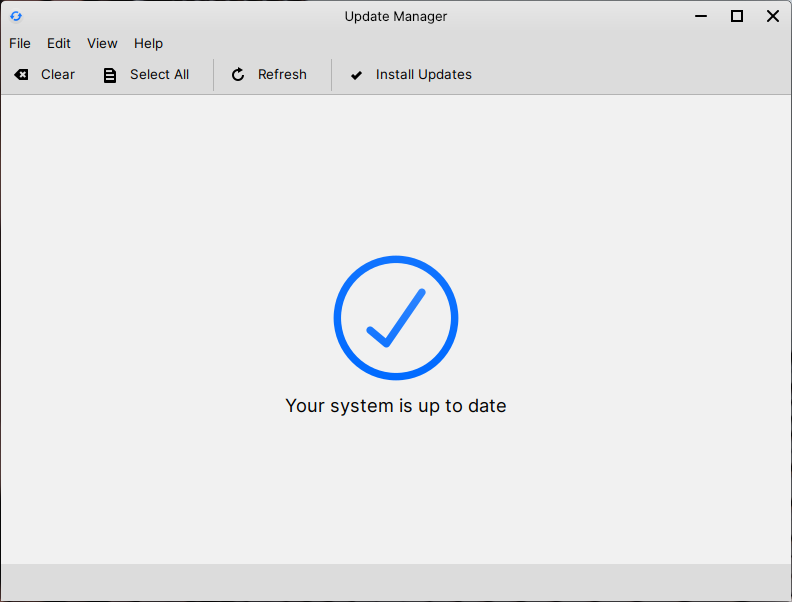

Update Manager
==================

What is Update Manager?
----------------

Update Manager is a built-in utility that allows you to manage and install updates for your system and applications. It's the application to use if updates are available for Feren OS, unless you want to wait for Feren OS to automatically update itself.

.. hint::
    Feren OS installs available updates daily automatically by default from the default set of repositories included in Feren OS. Packages from extra repositories you've added will not get automatically updated by default.

    Update Manager

To install available updates in Update Manager, click on :guilabel:`Install Updates`.

To check for updates, click on :guilabel:`Refresh`.

To select all the available updates so that they get installed when you click on :guilabel:`Install Updates`.

To select none of the available updates click on :guilabel:`Clear`.

Disabling Automatic Updates
-------------------------------------

.. warning::
    Disabling automatic updates is not recommended.
    
.. hint::
    The upcoming "Store Update" will add an easier way to toggle automatic updates. At that point this guide will be updated to reflect this.

If you don't want automatic updates to occur on a daily basis, you can easily disable it through a user with administrator privilleges.

To start off, you will want to edit ``/etc/apt/apt.conf.d/10periodic``. In Feren OS you just need to open this file in KWrite, and you will find it through Files at :menuselection:`File System --> etc --> apt --> apt.conf.d --> 10periodic`.

You should find a line saying ``APT::Periodic::Update-Package-Lists "1";``. Change the ``1`` to a ``0`` and save the document. Once the document is saved and the line is now saying ``APT::Periodic::Update-Package-Lists "0";`` restart and automatic updates should now be disabled.

.. hint::
    If the file doesn't yet exist, write that line in and save the file anew.