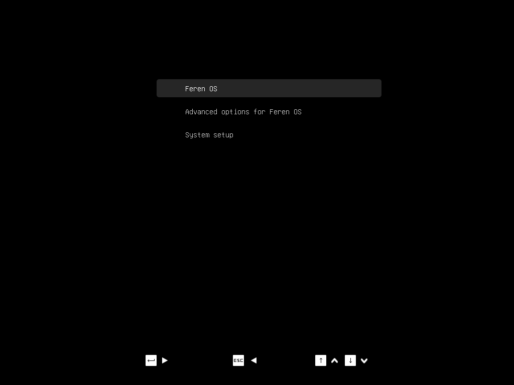

Booting with nomodeset for NVIDIA Hardware
==================

Booting with nomodeset on an installed system
----------------

If you had to use the "nomodeset" option to boot into the Feren OS Live Session earlier to install Feren OS, you may find that you will need to also boot into your newly installed Feren OS via "nomodeset" too. Thankfully this is very easy to do in Feren OS.

.. hint::
    You will only need to follow this guide if you had to use the "nomodeset" option to boot into Feren OS from your USB or DVD drive successfully. If you could boot using the normal boot option you can skip over this page and move on to `First Steps <https://feren-os-user-guide.readthedocs.io/en/latest/firststeps.html>`_.

To start this guide, you will need to open the Feren OS GRUB boot menu. If you installed Feren OS alongside your prior Operating System the boot menu should show itself automatically to let you choose the OS you want to boot into. However, if you installed Feren OS over your prior Operating System(s) you will need to force GRUB to show the boot menu.

To force GRUB to show the boot menu press :kbd:`ESC` once after the screen goes blank following the manufacturer's logo appearing on screen and before Feren OS starts booting. If you're successful, a screen similar to the one shown below will appear:

.. warning::
    If you are too early you'll trigger whatever pressing :kbd:`ESC` does on your machine's firmware before any Operating Systems start to load. If you are too late Feren OS will boot normally. Furthermore, if you press :kbd:`ESC` too many times you'll either enter the "GRUB command line" or back into your machine's firmware's boot menu or another menu on your machine's firmware.
    
    If you enter the "GRUB command line", type ``reboot`` and press :kbd:`Enter` to restart your machine.

    Feren OS GRUB Boot Menu

Now you are at the GRUB screen, scroll down to "Advanced options for Feren OS" and press the ENTER key. A new list of options will appear on-screen. Of these options, scroll down to "Feren OS, with Linux ... (nomodeset)" and press the ENTER key again. Feren OS should now start booting with nomodeset on.

Installing Drivers
----------------

Now you are in Feren OS, the next thing you need to do is install adequate NVIDIA Drivers for your machine. You can do this by going in Driver Manager. Please continue on to `Driver Manager <https://feren-os-user-guide.readthedocs.io/en/latest/drivermanager.html>`_ for instructions on installing your NVIDIA Drivers (as well as potentially some other drivers).

Once you have followed that guide, restart Feren OS and let it boot normally and then proceed to "First Steps" (the next page in this guide).
