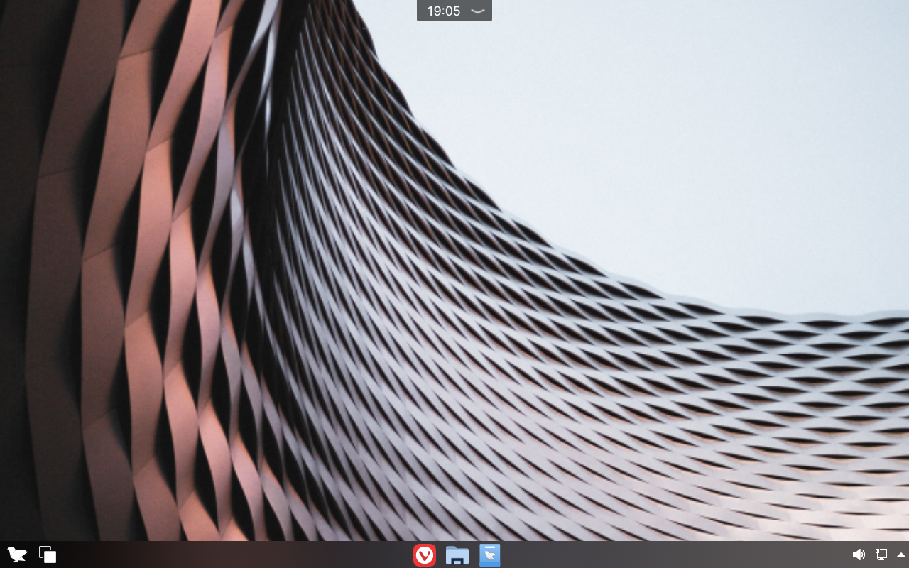
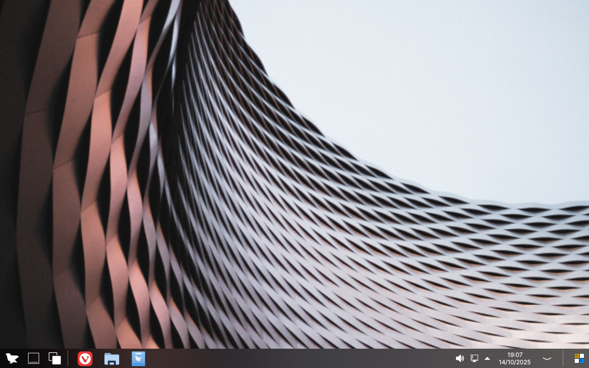
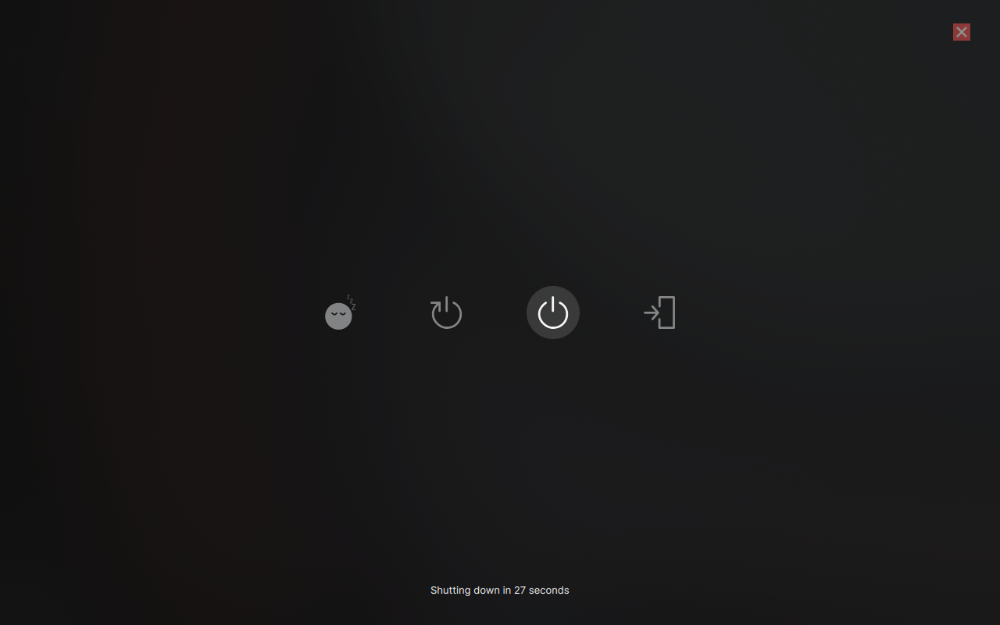

Using the Desktop
==================

The default Feren OS
----------------

When you first log into Feren OS, and if you skip over the layout section of the Tour, you will have this Desktop:

    The Feren OS Desktop

This Desktop by default, is laid out into these core fundamentals, although can be the beginnings of your own desktop customisation, otherwise known as "ricing", if you desire:

* Icons on the Desktop appear when files or folders are placed or added in the Desktop folder
* The "Status Notch" at the top-center of the screen houses your time, calendar and notifications
* The bottom Panel at the bottom of your screen houses the Applications Menu (bottom-left bird icon), Workspaces, the Task Manager (icons for pinned applications and open application windows), and the System Tray

.. hint::
    Click each icon in the System Tray to view more information about their statuses, and click the arrow at the end to view hidden tray icons where you can view their statuses.

    The Status Notch will automatically hide if a window is maximised or underlaying it - you can reveal it by just pushing your mouse up at the top-center of the screen until it pops out again.

Tablet Mode
----------------

If you choose Tablet Mode as your layout for Feren OS, the desktop will look and work slightly differently than it does by default.

    Tablet Mode in action

In this Desktop, the Status Notch is merged with the bottom Panel, as well as adding additional options to the bottom Panel, making Tablet Mode have these core fundamentals instead:

* Icons on the Desktop appear when files or folders are placed or added in the Desktop folder

And on the bottom Panel:

* The Applications Menu (bottom-left bird icon)
* A shortcut to return to your Desktop at any time
* Workspaces
* Task Manager (icons for pinned applications and open application windows)
* The System Tray
* Clock and Calendar
* Notifications
* On Screen Keyboard, aka Onboard

Powering off or logging out
----------------

To power your computer off, restart, sleep, switch users, lock or log out of Feren OS, open the Applications Menu and click one of the options (Lock, Log out or Shut Down) from the top-right. If you click the Shut Down button you will be greeted with the option to Sleep, Restart, Shut Down or Log Out.

.. hint::
    If your computer is set up to allow hibernate, Hibernate will also be available in the above options screen.