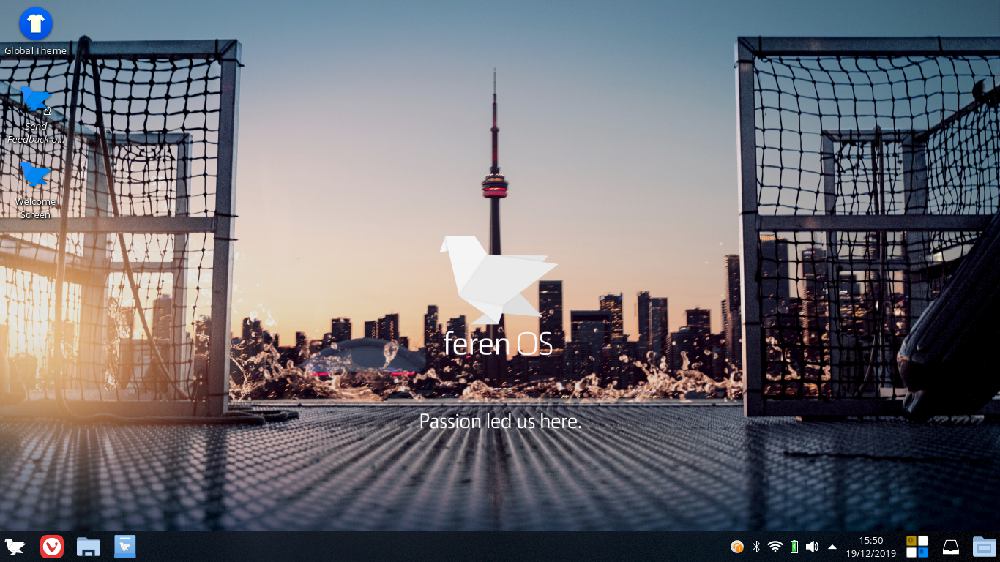
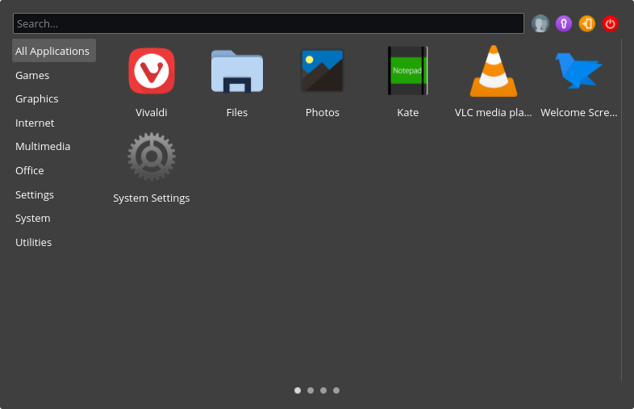
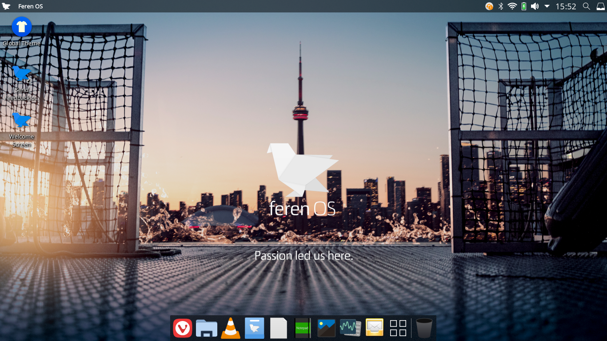
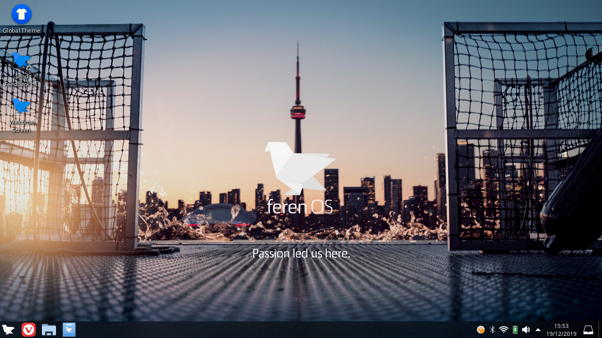
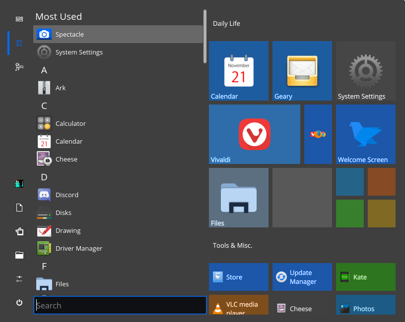
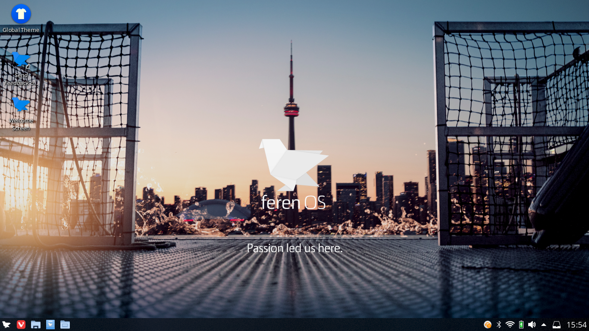
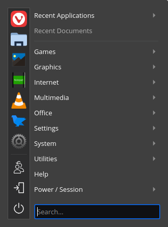
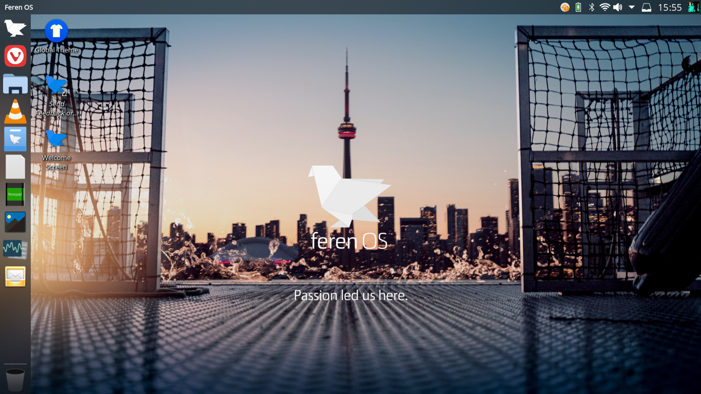
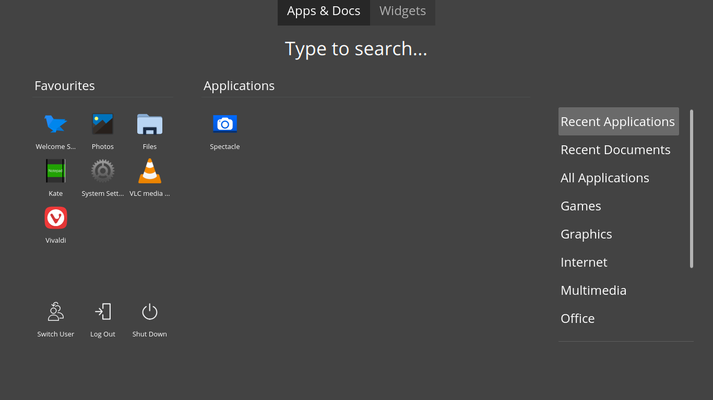

Using the Desktop
==================

The default Feren OS
----------------

When you first log into Feren OS, and if you skip over the layout section of "Welcome to Feren OS", you will have this desktop:

    The default Feren OS desktop

This desktop can be either left alone to be your default desktop or can be the beginnings of your own desktop customisation, however that is beside the point.

The desktop, by default, is laid out into these core fundamentals:

* Icons are on the desktop for whatever you place in your Desktop folder
* At the top-center of the screen there is the (appropriately dubbed) Cappuccino Notch housing both your time, calendar and notifications. If you open a window under the Cappuccino Notch it'll hide itself, until you hit your mouse against the top-center part of your screen hard enough, to stay out of your way.
* At the bottom-left you will find your Applications Menu (the Feren OS logo), and next to that your pinned and open applications
* Finally, at the bottom-right you will find your System Tray (click the up arrow to reveal hidden tray indicators and click each icon for their respective statuses)

Tablet Mode
----------------

If you choose Tablet Mode as your layout for Feren OS, the desktop will look and work slightly differently than it does by default.

    Tablet Mode in action

The desktop, in this layout, is laid out into these core fundamentals:

* Icons are on the desktop for whatever you place in your Desktop folder
* At the bottom-left you will find your Applications Menu (the Feren OS logo), and next to that your pinned and open applications
* Finally, at the bottom-right you will find your System Tray (click the up arrow to reveal hidden tray indicators and click each icon for their respective statuses), clock and calendar, an on-screen keyboard toggler, notifications and the show desktop button

Applications Menu - Simple Menu (Default and Tablet Mode)
----------------

The applications menu is the place to go to whenever you want to launch an application. It's quite simple to use when you get the hang of the menu, however I might as well explain what each part of the menu is and does.

* The list on your left is your categories - hover over each category to list applications in that category
* The search bar at the top lets you search for applications, settings, files and more
* The buttons on the top-right are your power buttons. They go in this order: Switch User, Lock, Log Out, Power Off
* The items on the remaining area of the menu are the applications from the current category that you are on
* If you're currently on the "All Applications" category, the first page is your favourite applications (every page following that is all the applications installed on your system)
* Finally, the circles at the bottom of the applications list represent how many pages of applications there are in your current category (the opaque circle represents what page you are on out of those pages)

.. hint::
    Tablet Mode uses Simple Menu instead of Application Dashboard as otherwise you currently cannot get an on-screen keyboard to make use of in Application Dashboard.

Cupertino Layout
----------------

If you choose Cupertino Layout as your layout for Feren OS, the desktop will look and work slightly differently than it does by default.

    Cupertino Layout in action

The desktop, in this layout, is laid out into these core fundamentals:

* Icons are on the desktop for whatever you place in your Desktop folder
* At the bottom-center you will find your dock containing your pinned and open applications, a shortcut to the Application Dashboard and your Wastebin
* At the top-left is a power menu, the title of the currently opened window and a menubar (for supported applications when they are open and currently focused (being used)).
* Finally, at the top-right you will find your System Tray (click the up arrow to reveal hidden tray indicators and click each icon for their respective statuses), the clock and calendar, notifications and search

Familiar Layout
----------------

If you choose Familiar Layout as your layout for Feren OS, the desktop will look and work slightly differently than it does by default.

    Familiar Layout in action

The desktop, in this layout, is laid out into these core fundamentals:

* Icons are on the desktop for whatever you place in your Desktop folder
* At the bottom-left you will find your Applications Menu (the Feren OS logo), and next to that your pinned and open applications
* Finally, at the bottom-right you will find your System Tray (click the up arrow to reveal hidden tray indicators and click each icon for their respective statuses), clock and calendar, notifications and the show desktop button

Applications Menu - Tiled Menu (Familiar Layout)
----------------

The applications menu is the place to go to whenever you want to launch an application. Familiar Layout's application menu is completely different to the default one, and it might even remind you of a certain other menu from somewhere else. Here's how it works:

* On the direct left of the menu is a row of buttons: Only Show Tiles, List Applications Alphabetically, List Applications By Categories, User Options, Documents Folder, Pictures Folder, Open Files, Open Settings and Power.
* The list next to that is all the applications installed on your system
* The search bar directly below the installed applications list lets you search for applications, settings, files and more
* Finally, the colourful blocks on the right are 'Tiles' - they're your favourite applications, basically, in this menu (they can be moved and resized however you want)

Redmond Layout
----------------

If you choose Redmond Layout as your layout for Feren OS, the desktop will look and work slightly differently than it does by default.

    Redmond Layout in action

The desktop, in this layout, is laid out into these core fundamentals:

* Icons are on the desktop for whatever you place in your Desktop folder
* At the bottom-left you will find your Applications Menu (the Feren OS logo), and next to that your pinned applications, Show Desktop and open applications
* Finally, at the bottom-right you will find your System Tray (click the up arrow to reveal hidden tray indicators and click each icon for their respective statuses), notifications, clock and calendar

Applications Menu - Application Menu (Redmond Layout)
----------------

The applications menu is the place to go to whenever you want to launch an application. Redmond Layout's application menu is completely different to the default one. Here's how it works:

* On the direct left of the menu is a row of buttons consisting of your favourite applications, Switch User, Log Out and Shut Down
* The list next to that is all the categories for applications installed on your system - hover over each category for the applications in that category to pop out in a sub-menu
* Finally, the search bar directly below the categories list lets you search for applications, settings, files and more

Ubuntu Unity Layout
----------------

If you choose Ubuntu Unity Layout as your layout for Feren OS, the desktop will look and work completely differently than it does by default.

    Ubuntu Unity Layout in action

The desktop, in this layout, is laid out into these core fundamentals:

* Icons are on the desktop for whatever you place in your Desktop folder
* At the left you will find a dock containing a shortcut to the Application Dashboard, your pinned and open applications and your Wastebin
* At the top-left is the title of the currently opened window and a menubar (for supported applications) when they are open and currently focused (being used) (when the focused window is maximised window buttons will also appear on the top-left in the top panel)
* Finally, at the top-right you will find your System Tray (click the up arrow to reveal hidden tray indicators and click each icon for their respective statuses), notifications, the clock and calendar and the user menu

Applications Menu - Application Dashboard (Cupertino and Ubuntu Unity Layout)
----------------

The applications menu is the place to go to whenever you want to launch an application. This menu takes a full-screen approach.

* The list on your left is your favourite applications
* The buttons directly beneath are for Switch User, Log Out and Shut Down
* The search text at the top lets you search for applications, settings, files and more
* The list on the center is the applications from the current category that you are on
* The list on your right is your categories - hover over each category to list applications in that category in the center

