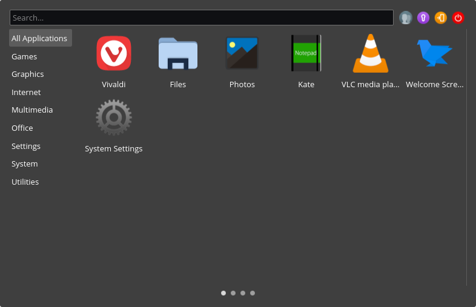

Using the Desktop
==================

The default Feren OS
----------------

When you first log into Feren OS, and if you skip over the layout section of "Welcome to Feren OS", you will have this desktop:

.. figure:: images/defaultdesktopplasma.png
    :width: 1366px
    :align: center

    The default Feren OS desktop

This desktop can be either left alone to be your default desktop or can be the beginnings of your own desktop customisation, however that is beside the point.

The desktop, by default, is laid out into these core fundamentals:

* Icons are on the desktop for whatever you place in your Desktop folder
* At the top-center of the screen there is the (appropriately dubbed) Cappuccino Notch housing both your time, calendar and notifications. If you open a window under the Cappuccino Notch it'll hide itself, until you hit your mouse against the top-center part of your screen hard enough, to stay out of your way.
* At the bottom-left you will find your Applications Menu (the Feren OS logo), and next to that your pinned and open applications
* Finally, at the bottom-right you will find your System Tray (click the up arrow to reveal hidden tray indicators and click each icon for their respective statuses)

Tablet Mode
----------------

If you choose Tablet Mode as your layout for Feren OS, the desktop will look and work slightly differently than it does by default.

.. figure:: images/tabletmodeplasma.png
    :width: 1366px
    :align: center

    Tablet Mode in action

The desktop, in this layout, is laid out into these core fundamentals:

* Icons are on the desktop for whatever you place in your Desktop folder
* At the bottom-left you will find your Applications Menu (the Feren OS logo), and next to that your pinned and open applications
* Finally, at the bottom-right you will find your System Tray (click the up arrow to reveal hidden tray indicators and click each icon for their respective statuses), clock and calendar, an on-screen keyboard toggler, notifications and the show desktop button

Applications Menu - Simple Menu (Default and Tablet Mode)
----------------

The applications menu is the place to go to whenever you want to launch an application. It's quite simple to use when you get the hang of the menu, however I might as well explain what each part of the menu is and does.

* The list on your left is your categories - hover over each category to list applications in that category
* The search bar at the top lets you search for applications, settings, files and more
* The buttons on the top-right are your power buttons. They go in this order: Switch User, Lock, Log Out, Power Off
* The items on the remaining area of the menu are the applications from the current category that you are on
* If you're currently on the "All Applications" category, the first page is your favourite applications (every page following that is all the applications installed on your system)
* Finally, the circles at the bottom of the applications list represent how many pages of applications there are in your current category (the opaque circle represents what page you are on out of those pages)

.. hint::
    Tablet Mode uses Simple Menu instead of Application Dashboard as otherwise you currently cannot get an on-screen keyboard to make use of in Application Dashboard.
