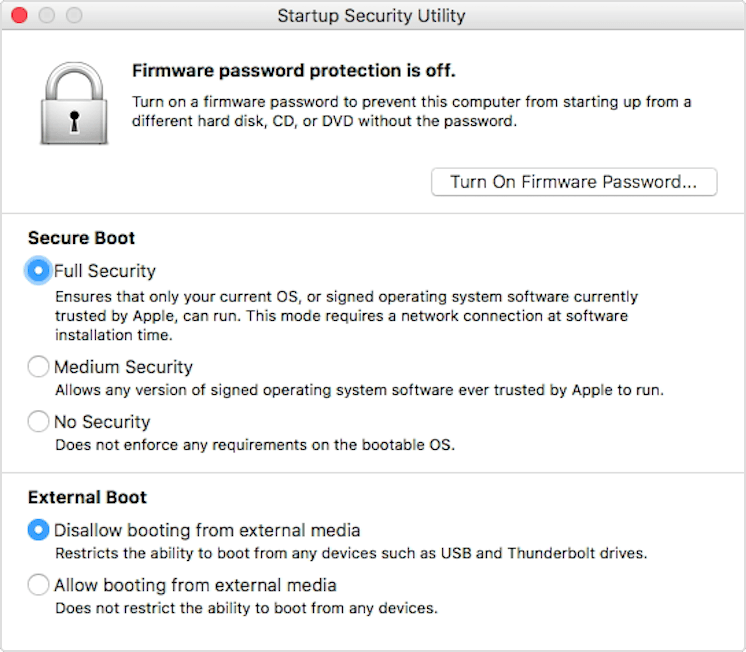

Making preparations in macOS
==================

Disabling Secure Boot for Modern Apple Devices
----------------

.. hint::
    This only affects Apple Devices that were made in 2018 or newer. Previous Apple Devices do not come with the T2 Security Chip and therefore should be able to boot Feren OS immediately with no fuss. If your device was made before 2018, you can safely skip to the next preparation on this page.

Modern Apple Devices have introduced the T2 Security Chip (or similar) out of the box. This security chip however prevents anything that is not Apple's macOS from running on these Mac Devices for security reasons.

However, since it does prevent booting into Feren OS as a result, you'll want to disable Secure Boot in order to be able to boot into Feren OS.

To disable Secure Boot, you'll first need to enter macOS Recovery. To do this, turn on your device and hold :kbd:`Command (⌘)` + :kbd:`R` after you see the Apple logo to boot into macOS Recovery.

Once in there, you'll see the "macOS Utilities" window. From here go to the top of the screen and look for a :guilabel:`Utilities` menu. Open it and select the :guilabel:`Startup Security Utility` option.

You will then be prompted to authenticate. From there click :guilabel:`Enter macOS Password`, choose an administrator account (e.g.: the first account you ever made on your device) and enter the password for that account.

If you've done this correctly, the window shown below should now pop up on screen:

    Source: https://support.apple.com/en-us/HT208330

To disable Secure Boot, choose :guilabel:`No Security` under :guilabel:`Secure Boot` and choose :guilabel:`Allow booting from external media` under :guilabel:`External Boot`.

Now simply close the window and restart back into macOS as you've done what you need to do here.

Making room for Feren OS
-------------------------------------

.. hint::
    This is only necessary if you want to install Feren OS alongside your macOS installation. If you want to install Feren OS over macOS, you can completely skip this section.

The final preparation you want to do is shrink your macOS Partition to make room for Feren OS later.

.. hint::
    "Partition" refers to an allocated amount of a disk (e.g.: your computer's hard drive) for data to be stored on, in simple terms. Different Operating Systems require different partitions to be made for them each. macOS usually puts a partition for the main Operating System on your hard drive.
    
To start off, you'll want to log into your existing macOS installation as an administrator. If you haven't created any extra users, your first created account is an administrator.

Now you're logged in, open up Disk Utility. Now select :guilabel:`View` on the toolbar at the top of Disk Utility. After that select :guilabel:`Show All Devices` in the menu that appears so that the option is turned on.

Now on the left sidebar, under :guilabel:`Internal` select the hard drive that contains :guilabel:`Macintosh HD` (don't select anything inside the hard drive on the sidebar, though, just select the hard drive itself). From there look back up at the toolbar for an option saying :guilabel:`Partition` and click it.

On the next dialog that appears (if you haven't disabled this dialog in the past) click :guilabel:`Partition`.

Now you're in the partitioner, look under the blue pie diagram that has a +/- button set. From there click :guilabel:`+` to create a new partition. You'll now have another item on the pie diagram. Drag the circle around on the edge of the pie diagram to resize the partition to be the maximum size you want Feren OS to use on your hard drive. Then, under :guilabel:`Format`, select :guilabel:`MS-DOS (FAT)` and then click :guilabel:`Apply`. Finally click :guilabel:`Partition` on the dialog that appears.

Once that is done, you can now restart macOS and proceed to boot into the USB or DVD that you flashed earlier.

Next Steps
-------------------------------------

- `Boot Feren OS from USB or DVD <https://feren-os-user-guide.readthedocs.io/en/latest/livecdboot.html>`_

- `Installing Feren OS over macOS <https://feren-os-user-guide.readthedocs.io/en/latest/installovermacos.html>`_

- `Installing Feren OS alongside macOS <https://feren-os-user-guide.readthedocs.io/en/latest/installwithmacos.html>`_