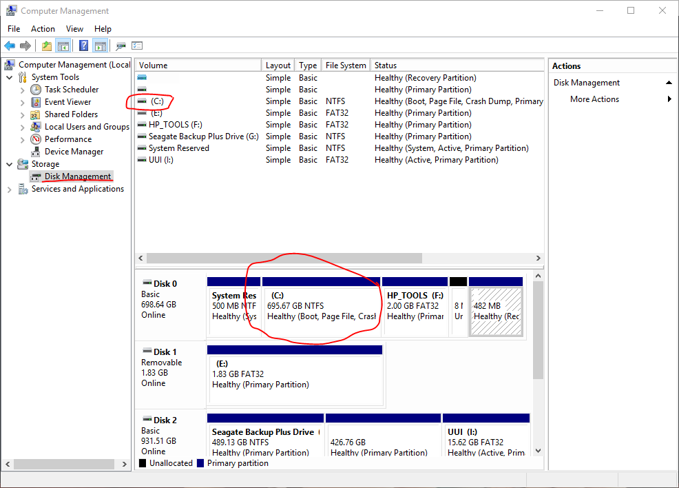

Making preparations in Windows
==================

Turn off Fast Startup (Windows 8, 8.1 and 10)
----------------

The latest versions of Microsoft Windows enabled a feature called Fast Startup by default. This feature basically makes your computer hibernate after some parts of Microsoft Windows have been terminated, rather than properly shutting down Windows, which makes the next boot much faster.

However, a side-effect of this is that Windows will never properly unmount your ``C:\`` drive meaning that it is unsafe to mount it in Feren OS with read and write access as long as Fast Boot is turned on.

Because of that it is recommended that you turn off Fast Startup in Windows before beginning the Feren OS installation process. You must do this if you want do either of these tasks:

- Back up data from your Microsoft Windows installation with Transfer Tool

- Install Feren OS alongside your Microsoft Windows installation

To turn off Fast Startup, do the following:

1. Open Start

2. Search for "Edit power plan" and open "Edit power plan" (in Microsoft Windows 10 this will also be indicated as a "Control panel" item)

3. In the address bar of the "Edit Plan Settings" window that appears click on :guilabel:`Power Options` (the bar at the top of the window)

4. On the left, there'll be a bunch of options, click :guilabel:`Choose what the power button does`

5. Click :guilabel:`Change settings that are currently unavailable` and authenticate if required

6. Uncheck the :guilabel:`Turn on fast start up (recommended)` checkbox

7. Click :guilabel:`Save changes`

Once you've done that, you've successfully disabled Fast Startup.

Making room for Feren OS
-------------------------------------

.. hint::
    This is only necessary if you want to install Feren OS alongside your Microsoft Windows installation. If you want to install Feren OS over Microsoft Windows, you can completely skip this section.

The next preparation you will want to make is to make some free space for Feren OS on the hard drive.

.. hint::
    "Free space" is not being used in the terminology you might think of here. Instead it refers to a partition-less area of your hard drive disk where you can add a partition in or expand an existing partition into.

To start things off, you will want to go into Start again and search for "compmgmt.msc". You should then get a result called "Computer Management". If you do then right-click on it and select :guilabel:`Run as Administrator` in the menu that appears.

You should see Computer Management now open. Next you'll want to look on the left, under :guilabel:`Storage`, and click on the item called :guilabel:`Disk Management`.

From here you'll now see a bunch of lettered drives listed on the middle. "(C:)" usually represents your Windows installation partition unless the Windows 'drive' in File Explorer -> Computer states a different letter in which case that letter represents the Windows installation partition instead.

.. hint::
    "Partition" refers to an allocated amount of a disk (e.g.: your computer's hard drive) for data to be stored on, in simple terms. Different Operating Systems require different partitions to be made for them each. Microsoft Windows usually puts a partition for the main Operating System and a partition for Microsoft Windows Recovery on your hard drive.
    

Now that you are in Disk Management, right-click the block at the bottom that has a letter that matches the letter of your Microsoft Windows partition (check in File Explorer -> Computer to see the letter). After that click on :guilabel:`Shrink Volume` on the menu that appears.

Windows will now take a few moments to check how far down the size of that partition can go. Once it's done, a dialog will appear. From here you should enter the amount of maximum disk space that you want Feren OS to have on your machine in the :guilabel:`Enter the amount to shrink in MB` box.

.. hint::
    1GB = 1024MB. It's best to use a Calculator here to calculate your desired disk space properly.
    
.. hint::
    The amount of space you are shrinking Windows by here will be the maximum disk space for Feren OS to install inside of. Therefore you should shrink it by the size you want Feren OS's disk space to be.
    
.. warning::
    Windows will cap the maximum size that you can shrink the disk up to depending on how much free space is left on the Windows partition. If you cannot get the disk to be shrunk to the space you want Feren OS to have, free up space on the Windows partition and try again.
    
.. warning::
    Feren OS should have 20GB or higher in disk space to be properly usable after being installed. Approximately 9GB of disk space is required to install Feren OS properly.

Now that you have done that, click :guilabel:`Shrink`. You should now see a block with a black top appear to the right of the Windows drive block that you right-clicked on earlier, at the bottom, once it has shrinked the Microsoft Windows partition. This should say "Unallocated". If it does, you have successfully made free space to install Feren OS onto later.

Turn off Secure Boot
-------------------------------------

.. hint::
    This section is only required for modern hardware that displays the manufacturer's logo at the top of the screen instead of the Microsoft Windows logo when booting into Microsoft Windows (loading animation under the logo). If your machine displays the Microsoft Windows logo while booting into Microsoft Windows you very likely won't need to and/or cannot disable Secure Boot (Secure Boot only exists on hardware that boots using `UEFI <https://wikipedia.org/wiki/Unified_Extensible_Firmware_Interface>`_).
    
Finally, you will want to turn off "Secure Boot" in your System Firmware settings.

You can boot into a Feren OS Live Session with Secure Boot turned on, however unless you disable it you cannot use certain drivers such as NVIDIA Hardware Drivers or Wireless Network Drivers for certain manufacturers such as Broadcom. You may also run into installation issues if it is turned on.

To turn off Secure Boot, you will first need to enter your System Firmware settings. There are different ways to enter System Firmware settings:

.. warning::
    Firmware Settings should never be configured just because you can, unless you are an experienced computer user. If you take even one misstep you could lock yourself out of your computer or worse. If you're unsure about disabling Secure Boot, ask a friend who has better experience with computers to help you with turning off Secure Boot.

- On Microsoft Windows 8, 8.1 and 10 go into Start -> Power -> (Hold SHIFT while clicking this option) Restart -> Troubleshoot -> Advanced options -> UEFI Firmware Settings -> Restart

- On other machines you will want to find out, using the internet, which key to press to enter System Firmware Settings. You should search for "(your machine's model here) enter BIOS settings" without the quotes in your favourite search engine to find out.

.. hint::
    At this point it is best to search the internet for a guide on disabling Secure Boot for your specific machine. This can be done by searching for "(your machine's model name) disable secure boot" on the internet. If you find a guide, use that guide and disregard this one.
    
.. warning::
    If you end up having to change the boot mode from "UEFI" or "EFI" to "CSM Boot" or "Legacy" to disable Secure Boot, you should have a USB or DVD flashed with your Feren OS ISO ready. If not, discard your changes, exit Firmware Settings and flash that ISO to a USB or DVD drive. If you do not do this, you could be stuck without anything to boot into until you undo your changes.

Now you are in the Firmware Settings screen, look around for a "Secure Boot" option. If you find an option for enabling Secure Boot then set it to be disabled.

If you can't find one or find one but can't change the value of it, look for an option with the value of "UEFI" or "EFI", or an option for "Legacy Boot" or "CSM Boot", instead. If you find one, set it so that it uses "CSM Boot" or "Legacy Boot" either before or instead of UEFI Boot.
    
Once you have done that, go into the :guilabel:`Exit` tab and choose :guilabel:`Save Changes and Exit` or similar to save your changes and restart the computer.

Next Steps
-------------------------------------

- `Boot Feren OS from USB or DVD <https://feren-os-user-guide.readthedocs.io/en/latest/livecdboot.html>`_

- `Using Transfer Tool to backup your data from Windows <https://feren-os-user-guide.readthedocs.io/en/latest/transfertoolbackupwindows.html>`_

- `Installing Feren OS over Windows <https://feren-os-user-guide.readthedocs.io/en/latest/installoverwindows.html>`_

- `Installing Feren OS alongside Windows <https://feren-os-user-guide.readthedocs.io/en/latest/installwithwindows.html>`_