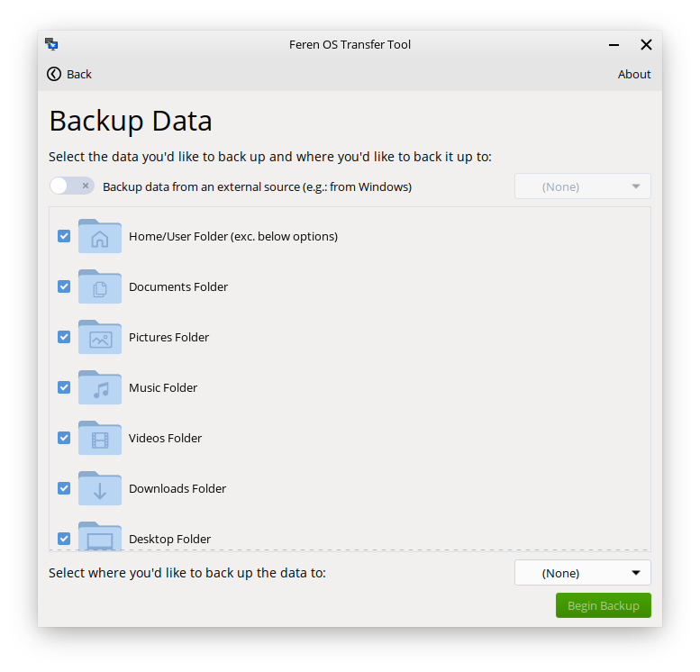

Backup data with Transfer Tool
==================

Requirements
----------------

To backup your data using Transfer Tool, you will need the following available:

* An external hard drive, or 2nd USB drive to temporarily hold the backed up data on
* Access to your existing Feren OS installation that you want to back up data from

Launching Transfer Tool
----------------

To start things off, you will want to be logged in to the user account you want to back up data from in Feren OS.

From there, go into the :menuselection:`Applications Menu (the bottom-left bird icon) --> System --> Transfer Tool` to launch Transfer Tool.

Once you've got Transfer Tool running, you'll be presented by this window:

.. figure:: ../images/transfertoolhomepage.png
    :width: 777px
    :align: center

Mounting the External Drive
----------------

Next, you'll want to mount one drive: Your external hard drive/2nd USB drive. You can do this by:

1. Launching Files - :menuselection:`Applications Menu --> Utilities --> Files`
2. Clicking on the drive in Files's left sidebar so that it has an eject icon on the right side of it.

.. hint::
    If you have not already plugged it in, you should plug the drive in and then mount it.

Backing up data with Transfer Tool
----------------

Now you have mounted the external backup drive ready for the backup process, go back into Transfer Tool and click on :guilabel:`Backup Data`.

On the next page in Transfer Tool make sure the switch at the top saying :guilabel:`Backup data from an external source` is switched off.

Now go to the dropdown at the bottom that says :guilabel:`Select where you'd like to back up the data to` and from there select your external hard drive/2nd USB drive.

Now the 'Begin Backup' button should be enabled - once it is enabled, just click 'Begin Backup' to begin the backup process.

Once you're done with Transfer Tool
----------------

Once the Transfer Tool has finished you will be taken to a new page that will either say all the data has been backed up successfully, most of the data has been backed up successfully, or that the whole backup process has failed.

.. figure:: ../images/transfertooldone.png
    :width: 777px
    :align: center

If your data was backed up successfully then you should close the Transfer Tool, open Files, hit the eject button on your external hard drive/2nd USB drive and then disconnect the external hard drive/2nd USB drive, physically, from your computer.

After doing that you can proceed to reboot into the Feren OS USB or DVD, ready to install Feren OS onto your machine.

Next Steps
----------------

* `Booting the USB or DVD <https://feren-os-user-guide.readthedocs.io/en/latest/reinstall/liveboot.html>`_