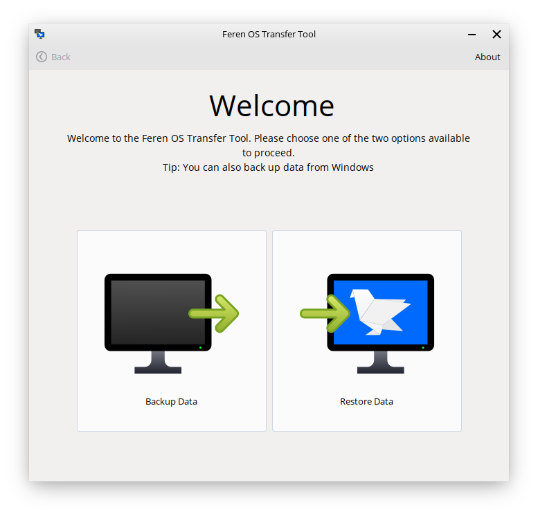
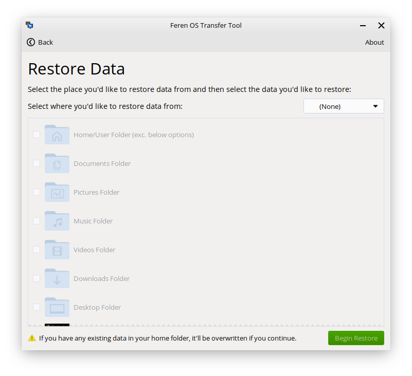
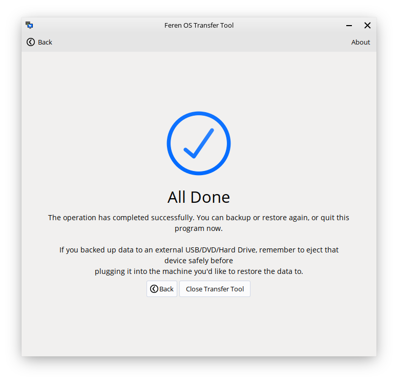

Restore data with Transfer Tool
==================

Requirements
----------------

You will need the following available:

* The external hard drive, or 2nd USB drive you temporarily transferred the backed up data to

Launching Transfer Tool
----------------

To start things off, you will want to be logged in to the user account you want to restore your data to in Feren OS.

From there, go into the :menuselection:`Applications Menu (the bottom-left bird icon) --> System --> Transfer Tool` to launch Transfer Tool.

Once you've got Transfer Tool running, you'll be presented by this window:

Mounting the External Drive
----------------

Next, you'll want to mount your external hard drive/2nd USB drive. You can do this by:

1. Launching Files - :menuselection:`Applications Menu --> Utilities --> Files`
2. Clicking on the drive in Files's left sidebar so that it has an eject icon on the right side of it.

.. hint::
    If you have not already plugged it in, you should plug the drive in and then mount it.

Restoring data with Transfer Tool
----------------

Now you have mounted the external backup drive ready for the backup process, go back into Transfer Tool and click on :guilabel:`Restore Data`.

On the next page in Transfer Tool go to the dropdown at the top that says :guilabel:`Select where you'd like to restore data from` and from there select your external hard drive/2nd USB drive.

Now the 'Begin Restore' button should be enabled. When it is enabled, just click 'Begin Restore' to begin the restoration process.

Once you're done with Transfer Tool
----------------

Once the Transfer Tool has finished you will be taken to a new page that will either say all the data has been restored successfully, most of the data has been restored successfully, or that the whole restoration process has failed.

If your data was restored successfully then you can close the Transfer Tool and start using Feren OS.