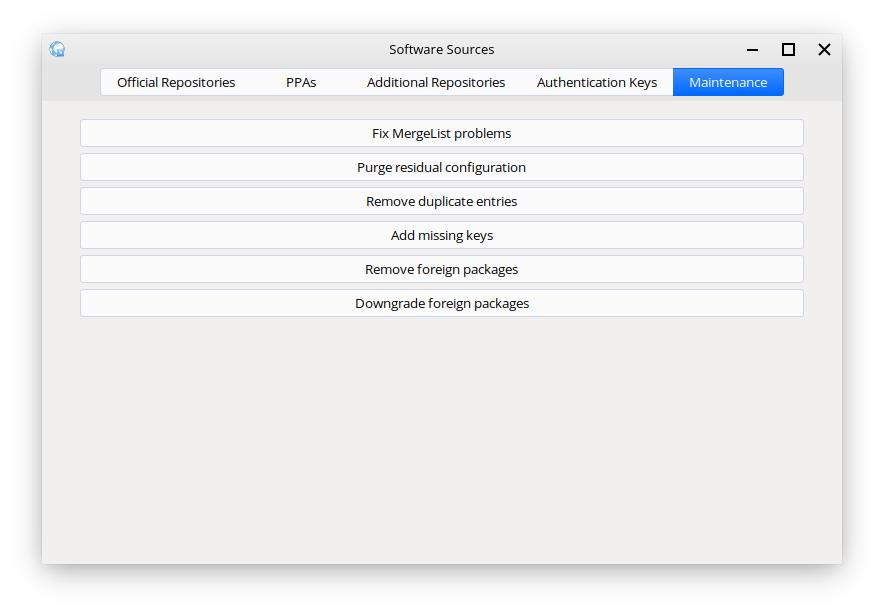

Removing or downgrading foreign packages
==================

Removing foreign packages
----------------

If you ever install packages from external places on the internet or have packages still installed from third-party repositories that you have removed, there is an easy way to find and remove these packages from your system.

First you will want to open up Software Sources. Software Sources can be opened via Applications Menu --> System / Administration --> Software Sources. Once you have Software Sources open, click the :guilabel:`Maintenance` tab at the top of the window.

.. warning::
    Only those with administrative privileges or those who can obtain these privileges can open Software Sources.

    Software Sources --> Maintenance

From here, click the :guilabel:`Remove foreign packages` button, wait a while for a new window to open, select the foreign packages you would like to remove from the list shown in that new window and then click :guilabel:`Remove` to remove those selected packages. Once that is done close Software Sources as you're done.

Downgrading foreign packages
----------------

If you ever update installed packages using third-party repositories that you have since removed, there is an easy way to find and downgrade these packages from your system back to their standard versions.

First you will want to open up Software Sources. Software Sources can be opened via Applications Menu --> System / Administration --> Software Sources. Once you have Software Sources open, click the :guilabel:`Maintenance` tab at the top of the window.

.. warning::
    Only those with administrative privileges or those who can obtain these privileges can open Software Sources.

    Software Sources --> Maintenance

From here, click the :guilabel:`Downgrade foreign packages` button, wait a while for a new window to open, select the foreign packages you would like to downgrade from the list shown in that new window and then click :guilabel:`Downgrade` to downgrade those selected packages. Once that is done and you are taken to a '#' prompt close that window and Software Sources as you're done.

.. warning::
    Definitely close the "Foreign packages" window once it is done. Keeping it open is a major security risk as, because of upstream code, it drops you to a Superuser SH Terminal prompt which gives anyone with physical access to the computer access to basically everything in Feren OS.