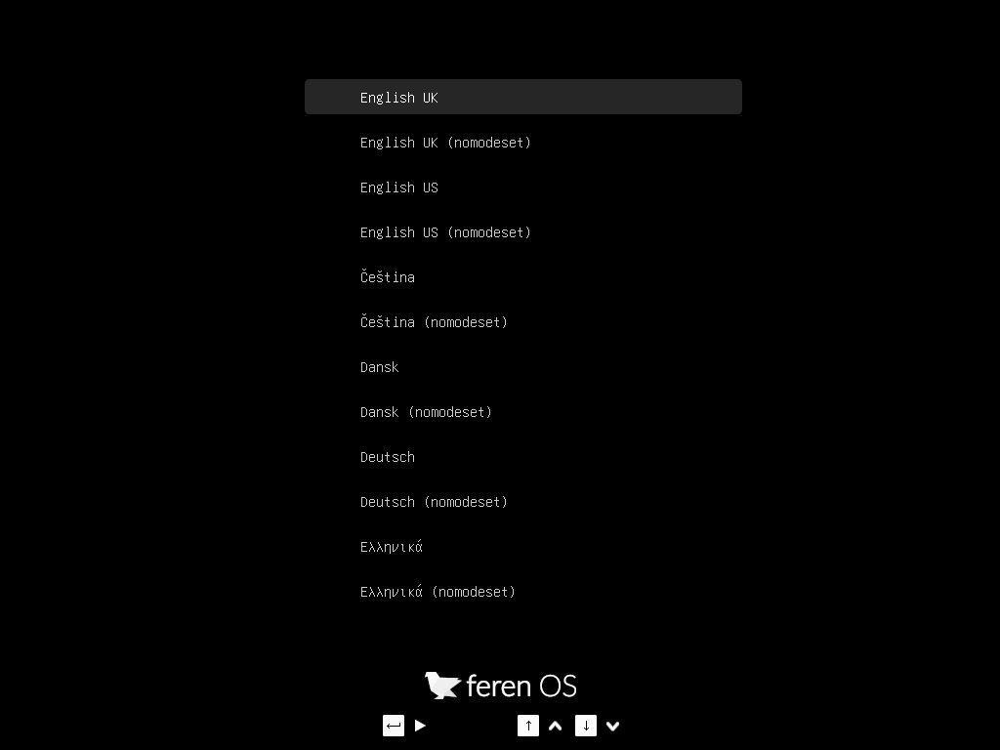

Booting the USB or DVD
===============

Now that you have Feren OS on a USB stick (or DVD), boot the computer from it.

1. Insert your USB stick (or DVD) into the computer.

2. Power on the computer, keeping your finger pressed on the :kbd:`Alt` or :kbd:`Option` key.

3. Select your USB stick (or DVD) in the boot options menu that appears.

4. When booted Feren OS will show a language select menu as depicted in the example shown below:

    Feren OS's language select menu

5. Scroll with the up and down arrow keys to your language and press :kbd:`Enter` to start Feren OS from your USB stick (or DVD).

Booting with 'nomodeset' (for NVIDIA users)
-------------------------------------

If you have NVIDIA Graphics on your device, you may run into graphical issues when booting into Feren OS normally as the correct drivers for your hardware are not present by default in Feren OS.

However, there is a quick workaround. In both boot menus there is an option called "nomodeset". If you're having problems with booting Feren OS normally on NVIDIA hardware then simply select the :guilabel:`nomodeset` option instead and Feren OS should boot, albeit with some graphical deficiencies compared to what it looks like once properly installed and with the correct drivers installed onto it.

Next Steps
----------------

* `Accessibility <https://feren-os-user-guide.readthedocs.io/en/latest/replacemac/accessibility.html>`_
* `Installing Feren OS <https://feren-os-user-guide.readthedocs.io/en/latest/replacemac/install.html>`_