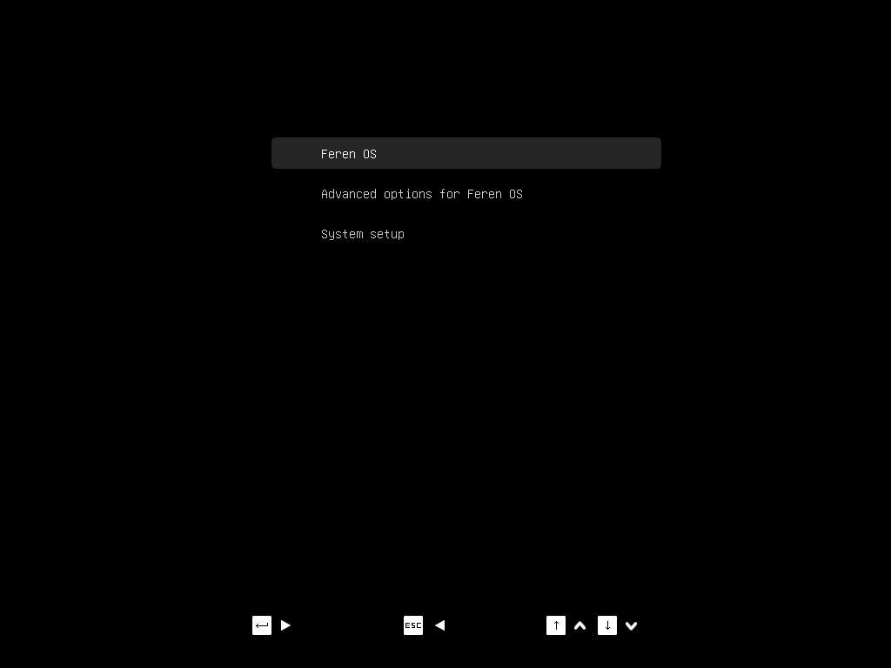
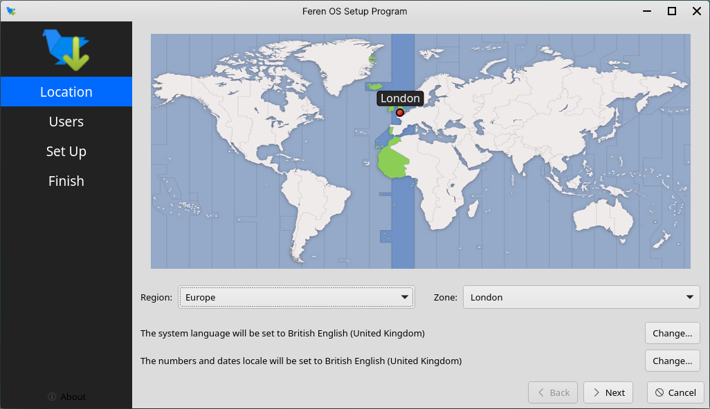
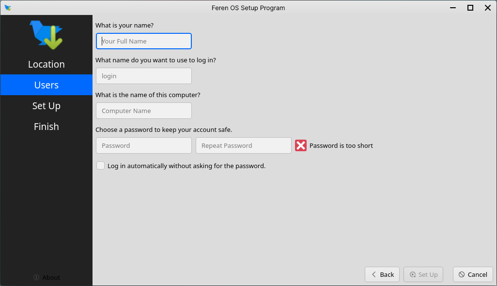
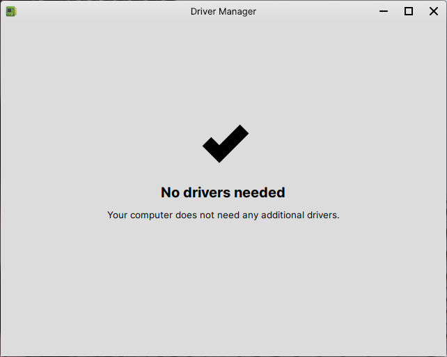

Setting up Feren OS
==================

Welcome to Feren OS! You now need to set Feren OS up with a user account.

Booting with 'nomodeset' (for NVIDIA users)
----------------

If you have NVIDIA Graphics on your device, and needed to use the :guilabel:`nomodeset` option to get Feren OS installed, you will need to boot into nomodeset again on your newly installed Feren OS.

To do this, hold :kbd:`Shift` once your manufacturer's logo appears when starting up your computer. If timed correctly, you will now see a boot options screen like the one depicted below:

    Feren OS's boot options menu

Scroll with the up and down arrow keys to :guilabel:`Advanced options for Feren OS` and press :kbd:`Enter`, then scroll to the first :guilabel:`(nomodeset)` option and press :kbd:`Enter` to boot into Feren OS with nomodeset.

Step 1: Select your location
----------------

You should see a location select screen. From here either click where you are on the world map or use the dropdown menus below the map to select your region and zone.

Once you've set your location click :guilabel:`Next` again.

Step 2: Create your user account
----------------

You should now see a bunch of textboxes asking you for your name, name to log in with, computer name, and password.

* Your name can be any name you would like - it will be the name shown for your user account on the login screen
* The name to log in with is a lowercase no spaces username used for some backend tasks in Feren OS
* The computer name is a name you can pick to identify your computer with against other computers in your house or network
* The password is a requirement to keep your account secure - make sure you use a memorable password and don't share it with anyone you don't want accessing your user account

Once you've filled each textbox as you see fit for your account, click :guilabel:`Set Up`.

.. warning::
    The "name to log in with", also known as your username, cannot be fully changed after Setup without creating a new user account.

After completing, Feren OS will restart automatically to finish Setup.

.. note::
    If you used nomodeset to boot in earlier, you will need to do so again.

Step 3: Get Drivers
----------------

Feren OS is now fully installed. To finish setting Feren OS up, you need to check for extra drivers available for your computer, and if available install them.

To do so:

1. Open Driver Manager (:menuselection:`Applications Menu (the bird icon on the bottom-left) --> System --> Driver Manager`).

.. hint::
    If you are offline, the Driver Manager will complain that it cannot connect to the Internet.

    .. figure:: ../images/mintdrivers-2.png
        :width: 642px
        :align: center

    Insert the USB stick or DVD you flashed/burned Feren OS onto earlier, wait for it to be mounted, and click :guilabel:`OK`.

2. If drivers are available, tick the appropriate checkboxes to select the available drivers and click :guilabel:`Apply Changes`.

3. Restart the computer once finished. You have successfully set up Feren OS!

Next Steps
-------------------------------------

* `Restoring data with Transfer Tool <https://feren-os-user-guide.readthedocs.io/en/latest/replacewin/transferrestore.html>`_
