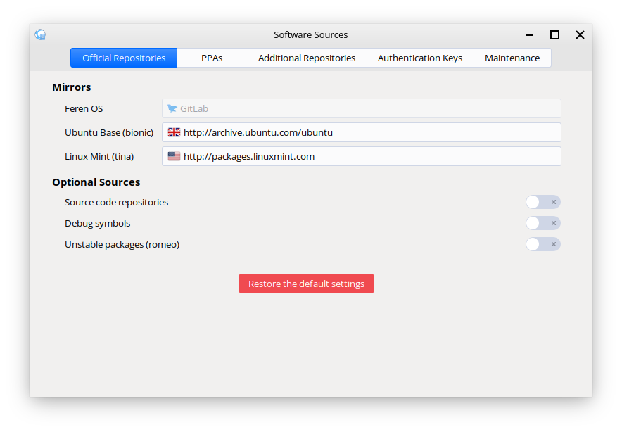

Resetting the package repositories
==================

If you ever make a mistake with the repositories on your system for obtaining packages for Feren OS from, there is a very easy way to reset your repositories.

First you will want to open up Software Sources. Software Sources can be opened via :menuselection:`Applications Menu --> System / Administration --> Software Sources`.

.. warning::
    Only those with administrative privileges or those who can obtain these privileges can open Software Sources.

    Software Sources

From here, click the red button at the bottom that says :guilabel:`Restore the default settings` and then click :guilabel:`OK` in the notice that then appears at the top of the window. Once that is done, simply close Software Sources - you're done.