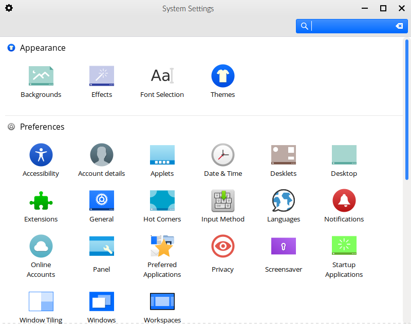

System Settings (Feren OS Classic)
==================

The System Settings Application
----------------

Feren OS Classic's System Settings application allows you to change most settings in your system.

    System Settings

On the home page of System Settings you will find each item in System Settings laid out in their categories.

You can also find some settings outside of System Settings, as well.

External Settings
-------------------------------------

There are some settings that currently reside outside of System Settings, under the following applications:

* Fingerprint GUI - manage Fingerprints for authentication on supported machines or machines with fingerprint readers plugged in
* Theme Colouriser - change the accent colour of the default Feren OS theme easily

The "Appearance" Category
-------------------------------------

As for the settings in System Settings, settings are split into categories depending on what they provide. Starting with the Appearance category, there is:

* Backgrounds - change your desktop background
* Effects - manage desktop effects and animations
* Font Selection - change the fonts used on your desktop
* Theme - change the theme, application style, Cinnamon style, cursor theme and icon set, among other small visual tweaks

The "Preferences" Category
-------------------------------------

In the Preferences category, there is:

* Accessibility - manage accessibility features
* Account details - edit your account details such as name, password and account picture
* Applets - manage the items on your panel
* Date & Time - configure date and time
* Desklets - manage widgets on your desktop
* Desktop - manage icons on your desktop
* Extensions - configure Cinnamon extensions
* General - configure miscellaneous Cinnamon settings
* Hot Corners - configure hotcorners and their actions
* Input Method - change your current Input Method (only necessary for certain languages on your system)
* Languages - manage and set your system's default languages and regions
* Notifications - configure how notifications show and their behaviour in the notifications history applet
* Online Accounts - configure Online Accounts integration for supported applications
* Panel - change panel settings
* Preferred Applications - change your default applications
* Privacy - change privacy settings in Cinnamon
* Screensaver - configure the lock screen
* Startup Applications - manage what programs launch on startup
* Window Tiling - change window tiling behaviour
* Windows - change general window manager behaviour
* Workspaces - configure virtual desktops for your user

The "Hardware" Category
-------------------------------------

In the Hardware category, there is:

* Bluetooth - manage paired bluetooth devices and change bluetooth settings
* Color - change colour settings for your display(s)
* Display - configure active monitors (for those with more than one screen), screen resolution, screen rotation and more
* Graphics Tablet - configure compatible graphics tablets
* Keyboard - configure keyboard settings, keyboard shortcuts and keyboard layout
* Mouse and Touchpad - configure your mouse and/or touchpad
* Network - manage known networks and configure proxy settings
* Power Management - configure Energy Saving settings and some other power settings
* Printers - manage printers on your system or network
* Sound - manage volume, sound effects and default input and output devices
* System Info - find out about the version of Feren OS you are using

The "Administration" Category
-------------------------------------

In the Administration category, there is:

* Driver Manager - launch Driver Manager
* Firewall - launch Firewall Configuration
* Login Window - launch Login Window
* Users and Groups - edit yours or others' account details such as name, password and account picture