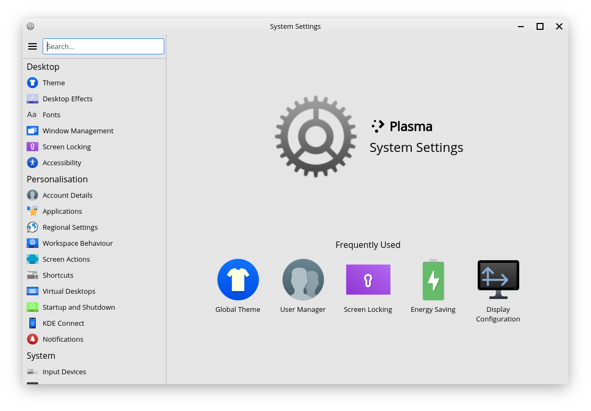

System Settings
==================

The System Settings Application
----------------

Feren OS's System Settings application allows you to change most settings in your system.

    System Settings

The list on the left is for all the categories and pages in System Settings. On the home page of System Settings, to the right, you will find the most frequently used settings that you've used.

You can also find some settings outside of System Settings, as well.

External Settings
-------------------------------------

There are some settings that currently reside outside of System Settings, under the following applications:

* Firewall Configuration - configure and/or toggle the Firewall built in to Feren OS
* Input Method - change your current Input Method (only necessary for certain languages on your system)
* Languages - manage and set your system's default languages and regions
* Login Window - change Login Screen settings such as the look and feel of the Login Screen, autologin and more
* Software Sources - change the package repositories on your machine
* Theme Colouriser - change the accent colour of the default Feren OS theme easily

The "Desktop" Category
-------------------------------------

As for the settings in System Settings, settings are split into categories depending on what they provide. Starting with the Desktop category, there is:

* Theme - change appearance settings such as the theme of your desktop and your desktop layout
* Desktop Effects - toggle on/off desktop effects
* Fonts - change the fonts used on your desktop
* Window Management - change settings for window behaviour and change how ALT+TAB works and looks
* Screen Locking - change your lock screen background and other lock screen settings
* Accessibility - toggle accessibility features

The "Personalisation" Category
-------------------------------------

In the Personalisation category, there is:

* Account Details - edit yours or others' account details such as name, password and account picture
* Applications - change default applications and file associations
* Regional Settings - configure date and time
* Workspace Behaviour - change minor workspace behaviour settings and choose between single-click to open files and folders or double-click
* Screen Actions - configure hotcorners and touch screen swipe actions
* Shortcuts - configure keyboard shortcuts and KRunner's web search feature's trigger
* Virtual Desktop - configure virtual desktops for your user
* Startup and Shutdown - manage what programs launch on startup and also change minor session startup behaviour settings
* KDE Connect - configure KDE Connect and manage paired devices
* Notifications - configure how notifications show, for how long they show, and more

The "System" Category
-------------------------------------

In the System category, there is:

* Input Devices - manage settings for mice, trackpads, keyboards, some game controllers and graphic tablets
* Display and Monitor - configure Night Color, active monitors (for those with more than one screen), screen resolution, screen rotation and more
* Audio - manage volume and default input and output devices
* Power Management - configure Energy Saving settings and some other power settings
* Removable Storage - configure device insertion actions, configure settings for some digital cameras and configure automatic mounting of external storage devices
* Network - manage known networks and configure proxy settings
* Printers - manage printers on your system or network
* Thunderbolt - configure Thunderbolt devices (not supported by most laptops and machines)

The "Advanced" Category
-------------------------------------

In the Advanced category, there is:

* About System - find out about the version of Feren OS you are using
* Other - configure miscellaneous, or mostly redundant, settings

The "Theme" Subcategory
-------------------------------------

In the Theme subcategory, there is:

* Global Theme - change the overall theme and layout of your Feren OS desktop
* Plasma Style - change the theme for KRunner, the panel, menus that pop up from the panel and more
* Window Decorations - change the way titlebars in supported applications look or change the layout of buttons on titlebars
* Application Style - change the application style used for Qt Applications (System Settings, desktop right-click menu, Kate, Konsole, Okular, etc.)
* GNOME/GTK Application Style - change the application style used for GTK Applications (almost everything else)
* Icons - change the icon set used in applications and on the desktop
* Colours - change the colour set used in applications, on titlebars and on supported Plasma Styles
* Cursors - change the way your pointer (the arrow you click things with) looks
* Splash Screen - change the animation that plays while logging in or disable it entirely
* Launch Feedback - change the animation that plays next to your pointer when an application is being launched
* Emoticons - change the emoticon style for supported applications

The "Other" Subcategory
-------------------------------------

Finally, in the Other subcategory, there is:

.. warning::
    Here be dragons. Some of these settings might either be useless or might result in bad things happening to your desktop. Be careful.

* File Search - change the behaviour of file and folder searching in the applications menu and in KRunner
* KRunner - configure KRunner, the :kbd:`ALT` + :kbd:`F2` command launcher
* Background Services - manage miscellaneous background services used by the desktop
* Activities - manage the Activities feature
* Activity Settings - configure Activities
* Compositor - manage the window compositor, change the compositing engine used and enable or disable the compositor entirely
* Locations - manage the locations for each folder on supported applications
* Spell Check - manage spell check settings on supported applications
* KWin Scripts - manage Window Manager scripts
* Window Rules - define special rules for certain windows or applications to follow
* Connection Preferences - configure miscellaneous network settings
* SSL Preferences - manage known certificates for supported applications
* Cache - configure cache options for supported applications
* Cookies - configure cookie options for supported applications
* Browser Identification - change the browser that websites identify you using on supported web browsers
* Gamma - configure the gamma settings for your screen(s)
* Audio CDs - configure CD-related settings for supported applications
* Windows Shares - configure the username and password used to authenticate into Windows Shares
* Font Management - manage fonts on your system