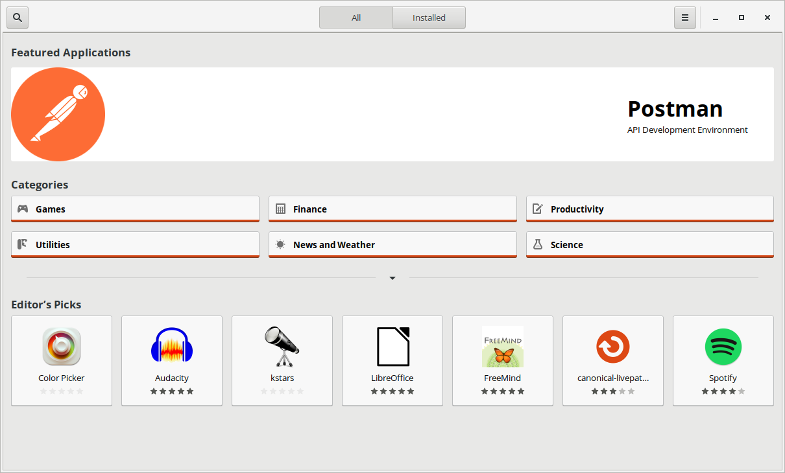
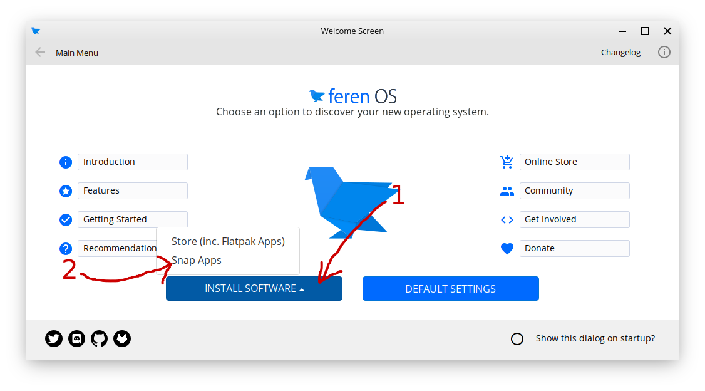

Snap Store
==================

What is the Snap Store?
----------------

The Snap Store is the go-to place for getting Snap Packages in Feren OS.

.. hint::
    Snap Packages are like Flatpaks - they're locked down (for security) applications designed to stay up to date at all times. However, there is only one adequate Snap repository currently for Snap Packages and these packages are regulated by the software publishers rather than also being carefully vetted by Canonical (the Snap Store owner).

    Snap Store

The Snap Store has a similar look and feel to the Store application (search is the magnifying glass symbol button on the top-left, the layout of the home page is very similar, and so on), so it should be easy to adjust to.

The Snap Store is not installed by default in Feren OS (neither is support for Snap Packages) though so you'll want to install Snap Store if you want to use it.

Installing Snap Store
-------------------------------------

The Snap Store is quite easy to install in Feren OS. To start off you will want to open up Welcome Screen to the home page.

Now you're on the home page, click :guilabel:`Install Software` then click :guilabel:`Snap Apps`.

Assuming you have not got Snap Store installed yet, you will now see a prompt asking you if you want to install "Snap Support". If you see this dialog, click :guilabel:`Yes` and then authenticate when prompted to.

A Terminal window will now open to show the progress of Snap Store installation. Let it do its job and once it has installed "Snap Support" the Terminal window will close and Snap Store will be automatically launched.

Where is Snap Store after installation?
-------------------------------------

After Snap Store is installed, you can quickly access it from the following places in the future:

* Applications Menu --> System --> Snap Store
* Welcome Screen --> Install Software --> Snap Apps

.. hint::
    The system may need to be restarted after installing Snap Store for it to appear in the applications menu.
    
    Furthermore, Feren OS Classic, because Cinnamon, may not be able to display Snap Applications in its applications menu at all.

Other Tips
-------------------------------------

To change settings in the Snap Store hit the hamburger (three lines) icon on the top-right of the Store window.