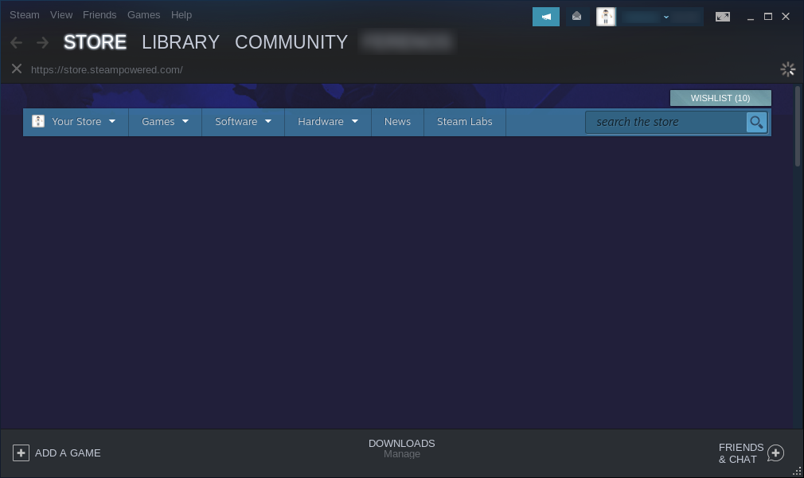

Steam
==================

How to install Steam
----------------

Steam is a very popular video game digital distribution service by Valve with a standalone software client. It is natively available on Feren OS and Linux, and Valve does a lot to work with multiple communities in the Linux gaming sector to make Steam even better for its Linux and Feren OS users.

    Steam in action

You can get Steam right from the Store. To find it in Store, do the following:

1. Open Store

2. Go to the :guilabel:`Games` category

3. Select :guilabel:`Steam` from the :guilabel:`All` subcategory

4. Hit :guilabel:`Install` on the Steam page in Store

.. hint::
    Can't find Steam in the haystack of applications listed? Just use the search bar at the top right to search for it instead.

Extra Tips
-------------------------------------

Enabling Steam Play for all titles is a great thing to do. By default Steam only lets you play some Windows-only games in Feren OS (as well as, obviously, native games that support Feren OS) that Valve has whitelisted. However, there are many games that can work in Feren OS that are Windows only.

To check how well your Windows-only Steam games and other games work in Feren OS, check out `ProtonDB <https://www.protondb.com>`_.

To enable Steam Play for all titles, open up Steam and then on the menu at the top-left of the Steam window click :guilabel:`Steam`. A menu should now pop up beneath that. Click :guilabel:`Settings`. A window will now pop up. On the left sidebar of that new window click :guilabel:`Steam Play`. Now finally look for and tick the checkbox saying :guilabel:`Enable Steam Play for all other titles` and click :guilabel:`OK`.

Now try running any Windows-only game in Steam that has a positive rating on ProtonDB.