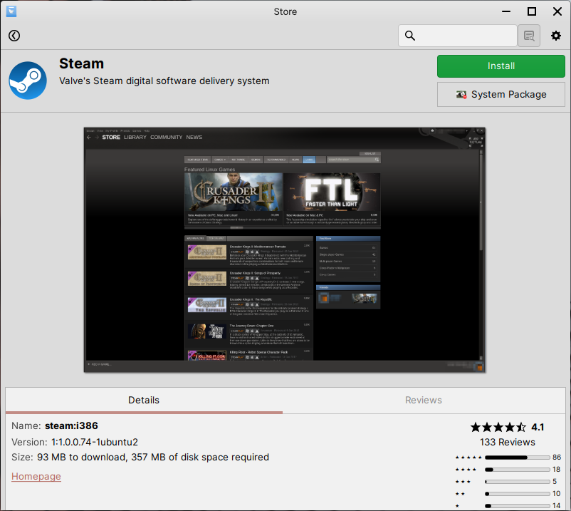

Steam
==================

Steam is the popular video game digital distribution service by Valve with a standalone software client. It is natively available on Feren OS, and Valve does a lot to work with multiple communities in the Linux gaming sector to make Steam even better for its Linux and Feren OS users.

You can get Steam right from the Store. To find it in Store, do the following:

1. Open Store

2. Go to the :guilabel:`Games` category

3. Select :guilabel:`Steam` from the :guilabel:`All` subcategory

4. Click :guilabel:`Install` on the Steam page in Store

.. hint::
    Can't find Steam in the applications listed? Just use the search bar at the top right to search for it instead.

    Steam in Store

ProtonDB
-------------------------------------

While Steam acknowledges many games' compatibility with Feren OS and Linux, their compatibility database doesn't tell the full story. Fortunately, the community has made ProtonDB, a website dedicated to the community's rankings of how compatible every Steam game is.

To use ProtonDB, navigate to `https://protondb.com <https://protondb.com>`_ in your web browser, search for the game that you want to check, and view its community-rated compatibility grade to verify what games, purchased or in your cart, are worth playing.