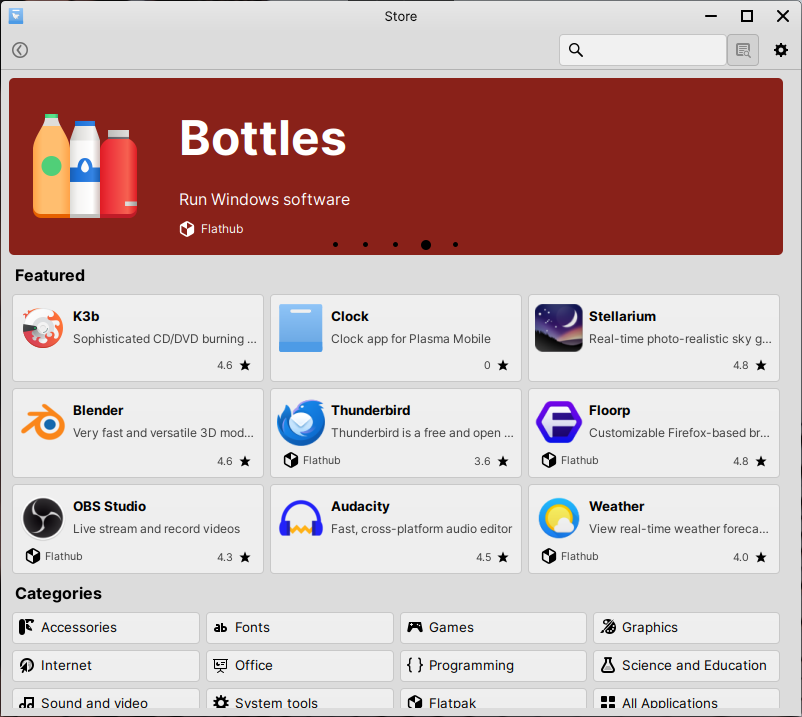
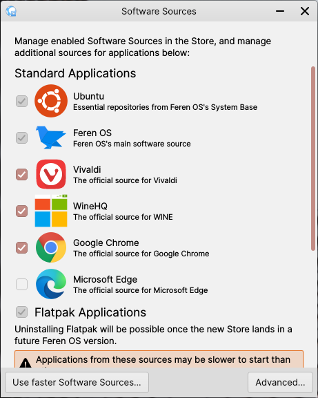

Store
==================

What is the Feren OS Store?
----------------

The Store is the central place for finding and installing all the applications available for Feren OS, accessible via :menuselection:`Applications Menu --> System --> Store` or from the Store icon in your bottom Panel.

.. hint::
    The Panel is the bar at the bottom of your screen, housing the Applications Menu, Task Manager, and System Tray.

    Feren OS's Store

You can find applications by browsing the categories at the bottom of Store's home page, or you can search for their names or (if you know them) package names from the search bar at the top-right of Store at any time.

.. hint::
    If you're viewing a category and start searching, Store will only search within that category - you can change this by pressing the button found to the right of the search bar (to the left of the Store menu) so that it isn't highlighted anymore.

Adding more sources to the Store
------------------------------------

You can add or remove additional application sources for Store to use by launching Software Sources from :menuselection:`Applications Menu --> System --> Software Sources`.

    Software Sources

Sources can be turned on and off individually by checking and unchecking their respective checkboxes to the left.

After managing sources, close and relaunch Store for the changes to take effect.

.. warning::
    Snap Store is known to take several failed attempts to successfully enable - this is a known issue - to enable it, try to turn it on several times, and if it still turns back off restart your computer and try again.

    Once enabled, Snap Store is a separate application that may be called "App Centre", and will require a restart to appear in the Applications Menu.

Categories in the Store
------------------------------------

The Store has categories at the bottom for listing most applications in the Store by each category. These categories are:

* Accessories - utilities for Feren OS
* Games - games for Feren OS
* Graphics - graphics utilities for Feren OS
* Internet - web browsing, email, chat and file sharing utilities for Feren OS
* Office - office utilities for Feren OS
* Programming - programming software for Feren OS
* Science and Education - science and education software for Feren OS
* Sound and video - multimedia playing and multimedia creating software for Feren OS
* System tools - system utilities for Feren OS
* Flatpak - list all the Flatpak packages available from the Store
* All Applications - a sample of all the applications available for Feren OS
* Below that is the rest of the description
* In the middle there are screenshots of the application (if any are available for the currently viewed application)
* In the :guilabel:`Details` section you will find the package name for the application, the version of the application's package and the estimated disk space requirements for installing the application
* Finally, at the bottom you'll find reviews for the application you are currently viewing

Preferences
-------------------------------------

To change settings in the Store hit the cog icon on the top-right of the Store window, then select :guilabel:`Preferences`.