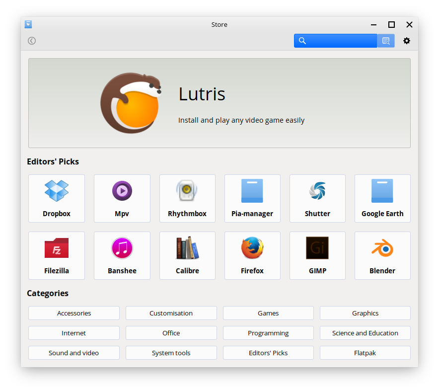
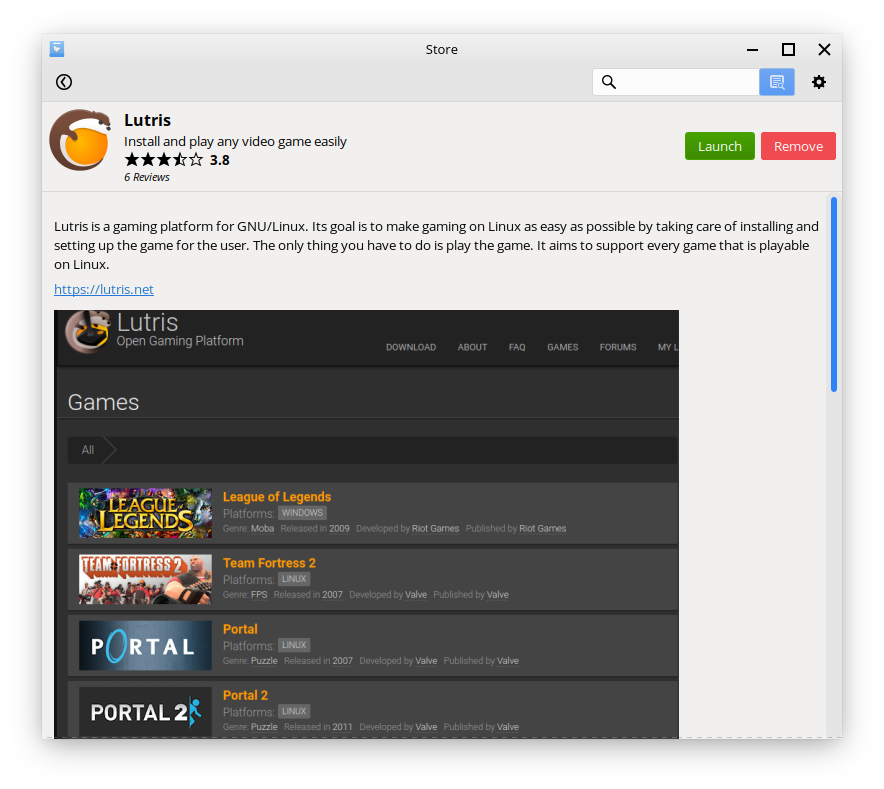

Store
==================

What is the Store?
----------------

The Store is the go-to place for getting most if not all the applications you'd ever need in Feren OS.

    Feren OS's Store

The home page, which you get greeted to, is split into the following sections:

* Suggested application (a randomly picked application from a pre-defined list of possible applications)
* Editors' Picks (some randomly items from a pre-defined list of applications for being applications of decent quality)
* Categories to list many applications by in the Store

You can also search for applications using the search bar at the top right either by their standard name (most of the time) or their package name.

Categories in Store
-------------------------------------

The Store has categories at the bottom for listing most applications in the Store by each category.

These categories are:

* Accessories - utilities for Feren OS
* Customisation - extra items to make use of when customising Feren OS
* Games - games for Feren OS
* Graphics - graphics utilities for Feren OS
* Internet - web browsing, email, chat and file sharing utilities for Feren OS
* Office - office utilities for Feren OS
* Programming - programming software for Feren OS
* Science and Education - science and education software for Feren OS
* Sound and video - multimedia playing and multimedia creating software for Feren OS
* System tools - system utilities for Feren OS
* Editors' Picks - the full list of pre-defined recommended applications
* Flatpak - list all the Flatpak packages available from the Store

Viewing an application in Store
-------------------------------------

Whenever you want to view an application in Store, you can simply click on the application in the listings of applications when either searching for applications or viewing a category.

When you are viewing the application, a screen similar to this one will appear:

* :guilabel:`Install` lets you install the application. This button will change into :guilabel:`Launch` and :guilabel:`Remove` if the application is installed.
* The top will give you the application's icon, the first line of its description and how its reviews score the application overall
* Below that is the rest of the description
* In the middle there are screenshots of the application (if any are available for the currently viewed application)
* In the :guilabel:`Details` section you will find the package name for the application, the version of the application's package and the estimated disk space requirements for installing the application
* Finally, at the bottom you'll find reviews for the application you are currently viewing

Other Tips
-------------------------------------

To change settings in the Store hit the cog icon on the top-right of the Store window.