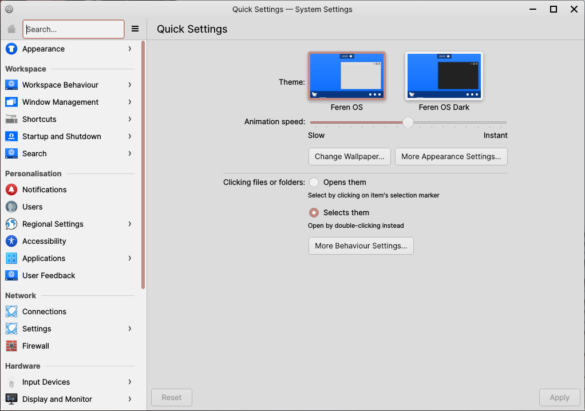

System Settings
==================

Feren OS's System Settings application allows you to change most settings in your system. It can be found at :menuselection:`Applications Menu --> Settings --> System Settings`.

    System Settings

The sidebar on the left provides access to all the categories of, and pages in, System Settings.

Upon being opened, on the right you will find Quick Settings - Quick Settings provides quick access to commonly modified settings, and will, upon further usage of System Settings, provide shortcuts to the pages of System Settings you visit most.

External Settings
-------------------------------------

There are some settings that currently reside outside of System Settings, under the following applications:

* Input Method - change your current Input Method (only necessary for certain languages on your system)
* Languages - manage and set your system's default languages and regions
* Login Window - change Login Screen settings such as the look and feel of the Login Screen, autologin and more