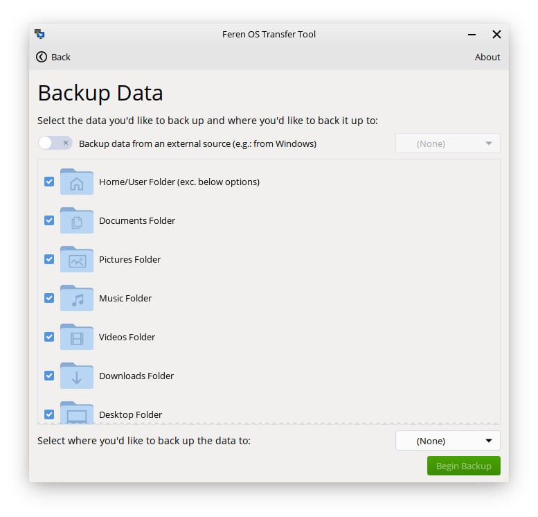

Using Transfer Tool to backup your data from Feren OS
==================

Requirements
----------------

To backup your data using Transfer Tool, you will need the following available:

* An external data storage device to temporarily hold the backed up data on
* Access to your existing Feren OS installation that you want to back up data from
* A working Feren OS Live Session (accessed by booting into the USB or DVD that you flashed/burned your Feren OS ISO file onto)

Launching Transfer Tool
----------------

To start things off, you will want to be logged in to the user account you want to back up data from in Feren OS.

From there, go into the :menuselection:`Applications Menu (the bottom-left bird icon) --> System --> Transfer Tool` to launch Transfer Tool.

Once you've got Transfer Tool running, you'll be presented by this window:

.. figure:: images/transfertoolhomepage.png
    :width: 777px
    :align: center

Mounting Drives
----------------

Next, you'll want to mount one drive: Your external backup drive. You can do this by clicking on it in Files's left sidebar so that it has an eject icon on the right-side of it.

.. hint::
    If you have not already plugged in your external backup drive, you should plug it in and then mount it.

Backing up data with Transfer Tool
----------------

Now you have mounted the external backup drive ready for the backup process, go back into Transfer Tool and click on :guilabel:`Backup Data`.

On the next page in Transfer Tool keep the switch at the top saying :guilabel:`Backup data from an external source` switched off (basically ignore the switch entirely, just keep it off).

Now go to the dropdown at the bottom that says :guilabel:`Select where you'd like to back up the data to` and from there select your external backup drive.

Now the 'Begin Backup' button should be enabled. When it is enabled, just click 'Begin Backup' to begin the backup process.

Once you're done with Transfer Tool
----------------

Once Transfer Tool has backed up the data, you'll be taken to a new page that will either say all the data has backed up successfully, most of the data has backed up successfully or the whole backup process has failed.

.. figure:: images/transfertooldone.png
    :width: 777px
    :align: center

If your data is backed up properly then you should close the Transfer Tool, open Files, hit the eject button on your external backup drive and then disconnect the external backup drive, physically, from your computer until later when you restore the data from the backup you made.

After doing that you can proceed to reboot your existing Feren OS and boot into the Feren OS Live Session ready to install the OS onto your machine.

Next Steps
----------------

* `Boot Feren OS from USB or DVD <https://feren-os-user-guide.readthedocs.io/en/latest/livecdboot.html>`_
* `Installing Feren OS over Linux <https://feren-os-user-guide.readthedocs.io/en/latest/installoverlinux.html>`_
* `Installing Feren OS alongside Linux <https://feren-os-user-guide.readthedocs.io/en/latest/installwithlinux.html>`_