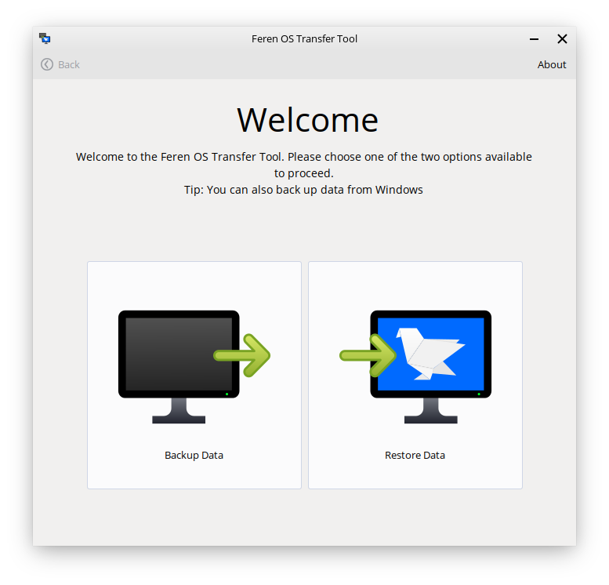
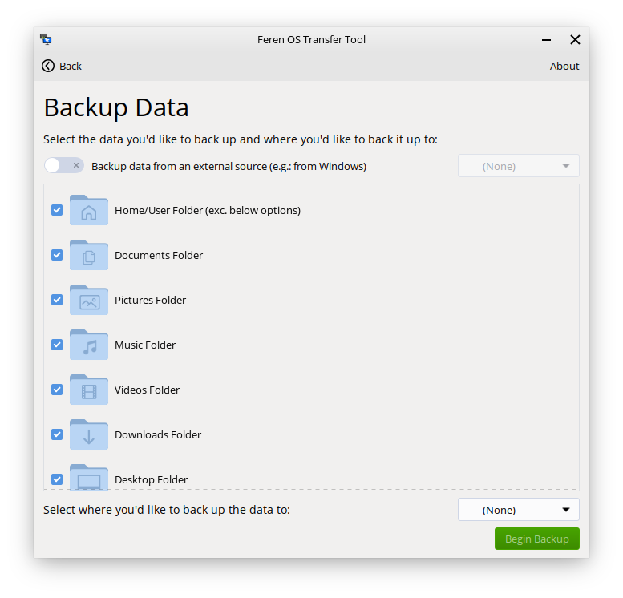
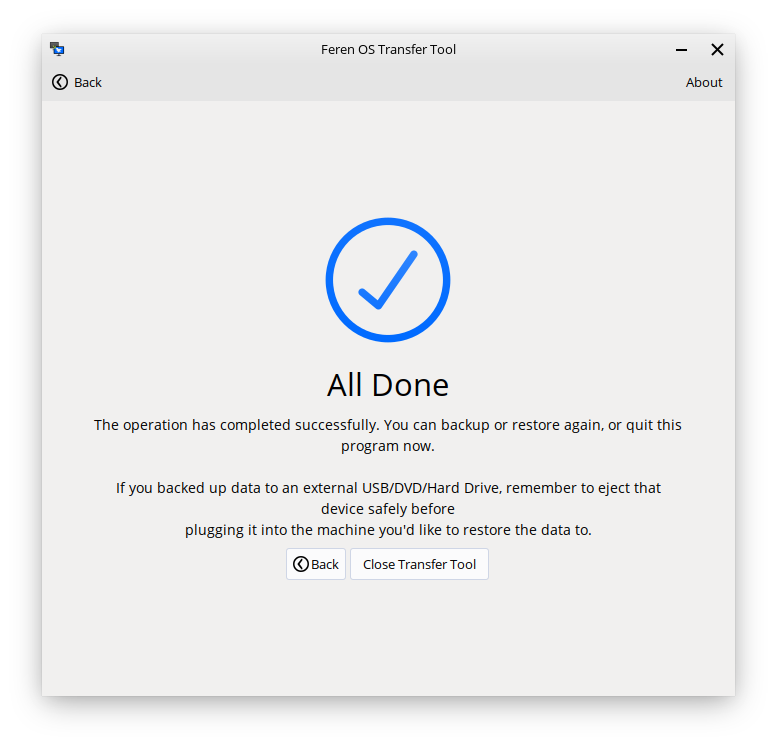

Using Transfer Tool to backup your data from Windows
==================

Requirements
----------------

To backup your data using Transfer Tool, you will need the following available:

* An external data storage device to temporarily hold the backed up data on
* Access to the existing installation of Windows you want to back up data from
* A working Feren OS Live Session (accessed by booting into the USB or DVD that you flashed/burned your Feren OS ISO file onto)
* If the Windows version you want to back up data from is Windows 8, 8.1 or 10, then you'll want Fast Startup turned off in Windows. You can refer to `Making preparations in Windows <https://feren-os-user-guide.readthedocs.io/en/latest/preparations/prepwindows.html#turn-off-fast-startup-windows-8-8-1-and-10>`_ to find out how to turn off Fast Startup

Video Guide
----------------

If you want a visual guide for all of these steps, there is a YouTube video that will guide you through all the necessary steps required to transfer data from Windows to Feren OS with Transfer Tool.

Note that this guide covers both backing up the data, before installing Feren OS over Windows, and restoring it after installing Feren OS over Windows. Therefore for the purpose of this part of the User Guide you should only follow the first half of the video guide for now.

The video can be found here: https://www.youtube.com/watch?v=MVN2NVvGCVI

If you want a text guide instead, continue reading below.

Launching Transfer Tool
----------------

To start things off, you will want to restart Windows normally and boot into the Feren OS USB or DVD flash/burn you did earlier to enter Feren OS.

.. hint::
    Refer to `Boot Feren OS from USB or DVD <https://feren-os-user-guide.readthedocs.io/en/latest/livecdboot.html>`_ for guidance on booting into the USB or DVD that you flashed/burned earlier

From there, go into the :menuselection:`Applications Menu (the bottom-left bird icon) --> System --> Transfer Tool` to launch Transfer Tool.

Once you've got Transfer Tool running, you'll be presented by this window:

Mounting Drives
----------------

Next, you'll want to mount two drives: Your external backup drive and your Windows data partition. You can do this by clicking on them in Files's left sidebar so that they have an eject icon on the right-side of them.

.. hint::
    If you have not already plugged in your external backup drive, you should plug it in and then mount it.

Backing up data with Transfer Tool
----------------

Now you have mounted all the drives necessary for the backup process, go back into Transfer Tool and click on :guilabel:`Backup Data`.

On the next page in Transfer Tool click on the switch at the top saying :guilabel:`Backup data from an external source` so that it's turned on. After that, click on the dropdown menu on the right of that switch and select your Windows partition.

Once this is done, an extra dialog will then pop up asking you which user you want to back up from. From there select the user you want to back up data from.

After that, the options to select what to back up should become usable once more.

.. warning::
    If the options to select what to back up do not become usable again after selecting your Windows partition, it means your drive has not been mounted or is not accessible. Try ejecting (unmounting) and remounting your Windows partition in this case and then relaunching Transfer Tool.

Now go to the dropdown at the bottom that says :guilabel:`Select where you'd like to back up the data to` and from there select your external backup drive.

Now the 'Begin Backup' button should be enabled. When it is enabled, just click 'Begin Backup' to begin the backup process.

Once you're done with Transfer Tool
----------------

Once Transfer Tool has backed up the data, you'll be taken to a new page that will either say all the data has backed up successfully, most of the data has backed up successfully or the whole backup process has failed.

If your data is backed up properly then you should close the Transfer Tool, open Files, hit the eject button on your external backup drive and then disconnect the external backup drive, physically, from your computer until later when you restore the data from the backup you made.
   
Next Steps
-------------------------------------

* `Boot Feren OS from USB or DVD <https://feren-os-user-guide.readthedocs.io/en/latest/livecdboot.html>`_
* `Installing Feren OS over Windows <https://feren-os-user-guide.readthedocs.io/en/latest/installoverwindows.html>`_
* `Installing Feren OS alongside Windows <https://feren-os-user-guide.readthedocs.io/en/latest/installwithwindows.html>`_