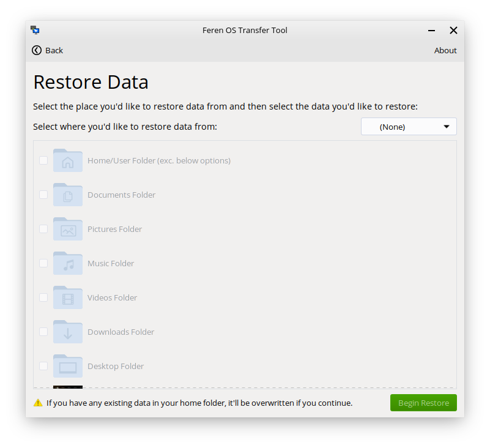

Restoring data with Transfer Tool
==================

Requirements
----------------

To restore your data using Transfer Tool, you will need the following available:

* The external data storage device that you backed up your data to earlier with Transfer Tool
* Access to your new Feren OS installation

Video Guide
----------------

If you want a visual guide for all of these steps, there is a YouTube video that will guide you through all the necessary steps required to transfer backed up data to Feren OS with Transfer Tool.

Note that this guide covers both backing up the data (from Windows), and restoring it after installing Feren OS over Windows. Therefore for the purpose of this part of the User Guide you should only follow the second half of the video guide.

The video can be found here: https://www.youtube.com/watch?v=MVN2NVvGCVI

If you want a text guide instead, continue reading below.

Launching Transfer Tool
----------------

To start things off, you will want to be logged in to the user account you want to restore data to in Feren OS.

From there, go into the :menuselection:`Applications Menu (the bottom-left bird icon) --> System --> Transfer Tool` to launch Transfer Tool.

Once you've got Transfer Tool running, you'll be presented by this window:

.. figure:: images/transfertoolhomepage.png
    :width: 777px
    :align: center

Mounting Drives
----------------

Next, you'll want to mount one drive: Your external backup drive. You can do this by clicking on it in Files's left sidebar so that it has an eject icon on the right-side of it.

.. hint::
    If you have not already plugged in your external backup drive, you should plug it in and then mount it.

Restoring data with Transfer Tool
----------------

Now you have mounted the external backup drive ready for the restoration process, go back into Transfer Tool and click on :guilabel:`Restore Data`.

On the next page in Transfer Tool go to the dropdown at the top that says :guilabel:`Select where you'd like to restore data from` and from there select your external backup drive.

Now the 'Begin Restore' button should be enabled. When it is enabled, just click 'Begin Restore' to begin the restoration process.

Once you're done with Transfer Tool
----------------

Once Transfer Tool has restored your data, you'll be taken to a new page that will either say all the data has restored successfully, most of the data has restored successfully or the whole restoration process has failed.

.. figure:: images/transfertooldone.png
    :width: 777px
    :align: center

If your data has restored properly then you should close the Transfer Tool. Feel free to then eject your drive as you'll no longer need it for the rest of the User Guide.

After doing that you can proceed to start properly setting up Feren OS. Have fun!

Next Steps
----------------

* `First Steps <https://feren-os-user-guide.readthedocs.io/en/latest/firststeps.html>`_
* `Welcome Screen <https://feren-os-user-guide.readthedocs.io/en/latest/welcomescreen.html>`_